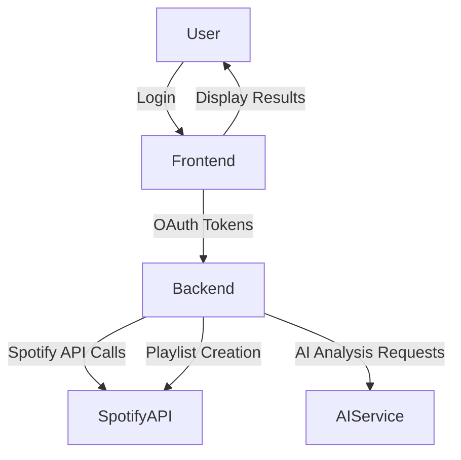
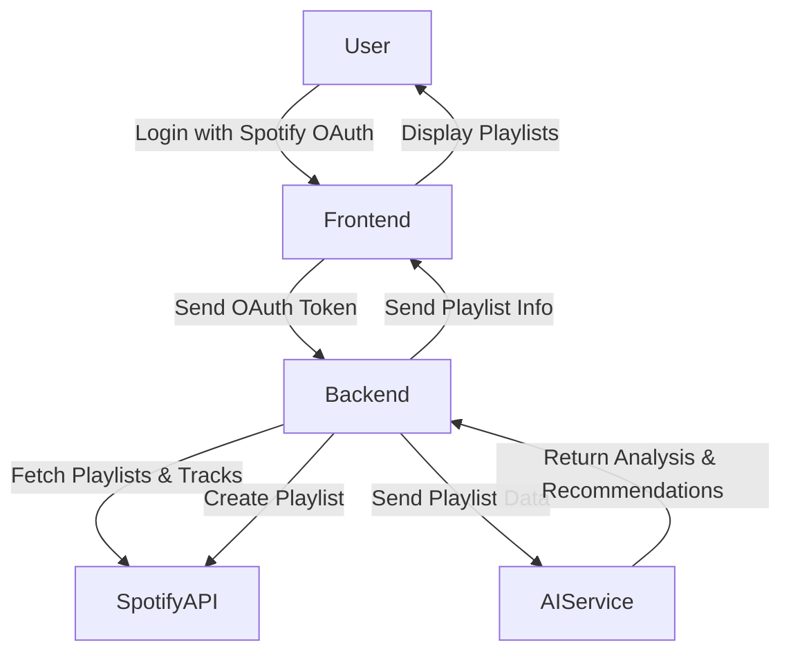
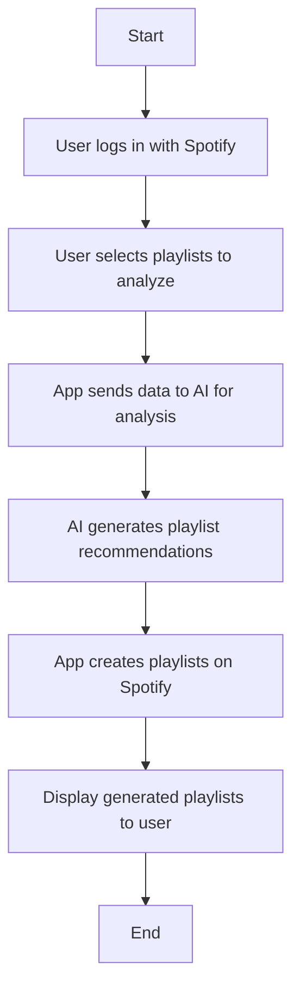

# Spotify Playlist AI Generator

## Project Overview

This project is a web application built with Next.js that generates personalized Spotify playlists based on the user's musical taste. It integrates with the Spotify API to access user playlists and listening data, and leverages AI powered by OpenAI GPT or similar large language models to analyze and identify the user's music preferences. Based on this analysis, the app generates new playlists tailored to the user's unique taste.

## Features

### Functional

- User authentication via Spotify OAuth.
- Fetch user playlists and track metadata from Spotify.
- Allow users to select one or multiple playlists or the entire library for analysis.
- AI-based musical taste analysis using OpenAI GPT or similar.
- Generate new playlists based on AI recommendations.
- Create and save generated playlists in the user's Spotify account.
- Responsive and intuitive UI for desktop and mobile.
- Graceful error handling for API and AI service failures.
- Secure handling of user data and tokens during sessions.

### Non-Functional

- Fast load and response times (under 3 seconds for UI, under 10 seconds for AI analysis).
- Scalable architecture to support multiple concurrent users.
- Intuitive and accessible user interface.
- Reliable handling of API rate limits and errors.
- Modular, well-documented, and maintainable codebase.
- Secure storage and transmission of sensitive data.

## System Architecture

The system consists of the following main components:

- **Frontend (Next.js):** Handles user interface, authentication, and interaction with backend services.
- **Backend API Routes (Next.js API):** Acts as a proxy for Spotify API calls and AI service requests, managing authentication tokens and business logic.
- **Spotify API:** Provides access to user playlists, track metadata, and playlist creation.
- **AI Service (OpenAI GPT or similar):** Analyzes user playlists to identify musical taste and generate playlist recommendations.



## Data Flow and User Flow

### Data Flow



### User Flow



## Deployment and Environment Setup

### Development Environment

- **Bun** (version 1.0 or higher) - This project uses Bun as the JavaScript runtime for faster package management and execution.
- Environment variables for Spotify API credentials, OpenAI API key, and other secrets
- Local development with Next.js dev server

### Environment Variables

- `SPOTIFY_CLIENT_ID`
- `SPOTIFY_CLIENT_SECRET`
- `SPOTIFY_REDIRECT_URI`
- `OPENAI_API_KEY`
- `NEXT_PUBLIC_BASE_URL` (for frontend API calls)

### Deployment

- Recommended platform: Vercel (optimized for Next.js)
- Configure environment variables securely in the deployment platform
- Use serverless functions (Next.js API routes) for backend logic
- Enable HTTPS and secure headers
- Set up monitoring and logging for production environment

### Continuous Integration / Continuous Deployment (CI/CD)

- Use GitHub Actions or similar for automated testing and deployment
- Run linting, formatting, and tests on pull requests
- Deploy automatically on merge to main branch

### Installing Bun

This project uses Bun as the JavaScript runtime and package manager for faster performance. To install Bun, follow the instructions at [https://bun.sh/docs/installation](https://bun.sh/docs/installation).

For macOS/Linux:

```bash
curl -fsSL https://bun.sh/install | bash
```

For Windows:

```powershell
powershell -c "irm bun.sh/install.ps1 | iex"
```

### Local Setup Instructions

1. Clone the repository
2. Install dependencies with `bun install`
3. Create a `.env.local` file with required environment variables
4. Run the development server with `bun run dev`
5. Access the app at `http://localhost:3000`

**Note:** The `bun.lock` file ensures consistent dependency versions across environments. Always use `bun install` and `bun run` commands to maintain compatibility with the project's Bun setup.

## Commit Message Conventions

This project uses **semantic commits with Gitmoji prefixes** to improve clarity, consistency, and automation in version control.

### Format

```text
<emoji> type(scope): message
```

### Example

```text
✨ feat(frontend): add playlist preview feature
```

### Common Types and Emojis

| Type      | Emoji | Description                          |
|-----------|-------|------------------------------------|
| feat      | ✨    | Add a new feature                   |
| fix       | 🐛    | Bug fix                            |
| docs      | 📝    | Documentation update               |
| style     | 🎨    | Code style changes (no logic)      |
| refactor  | ♻️    | Code refactor (no feature/bug fix) |
| perf      | ⚡    | Performance improvement            |
| test      | ✅    | Add or update tests                |
| build     | 📦    | Build-related changes              |
| ci        | 👷    | CI/CD changes                     |
| chore     | 🔧    | Other minor tasks                  |
| revert    | ⏪    | Revert a previous commit           |

For more details, see the [commit message conventions documentation](project-docs/commit-message-conventions.md).

---

## License

This project is licensed under the MIT License. See the LICENSE file for details.
