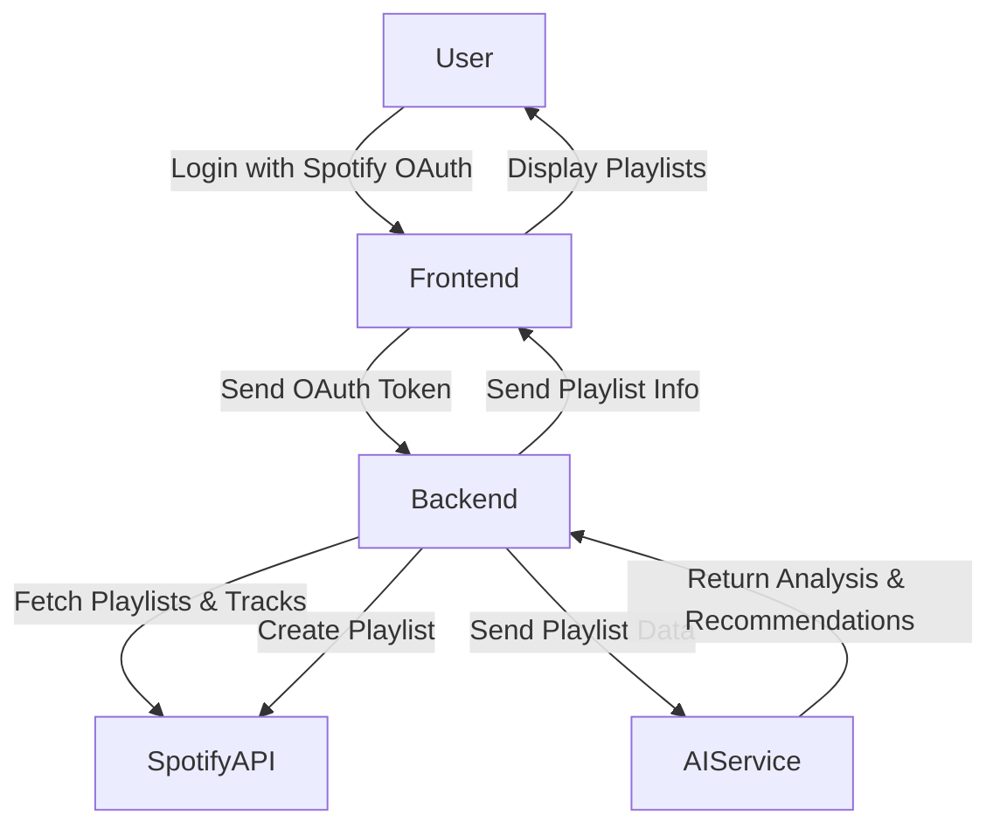
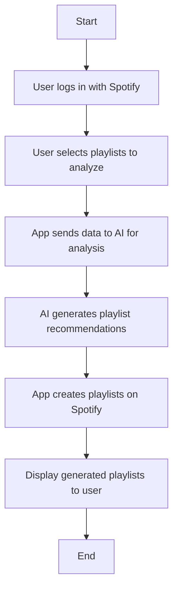

# Data Flow and User Flow

## Data Flow

### Data Flow - Description

1. User logs in via Spotify OAuth on the frontend.
2. Frontend sends OAuth token to backend API routes.
3. Backend fetches user playlists and track metadata from Spotify API.
4. Backend sends playlist data to AI service for analysis.
5. AI service returns musical taste insights and playlist recommendations.
6. Backend creates new playlists on Spotify based on AI recommendations.
7. Backend sends playlist information to frontend.
8. Frontend displays generated playlists and status to the user.

## User Flow

### User Flow - Description

- The user initiates the app and logs in with their Spotify account.
- The user selects one or more playlists or all playlists for analysis.
- The app processes the data through AI to identify musical taste.
- The app generates new playlists based on AI recommendations.
- The new playlists are created in the user's Spotify account.
- The user views and interacts with the generated playlists.
