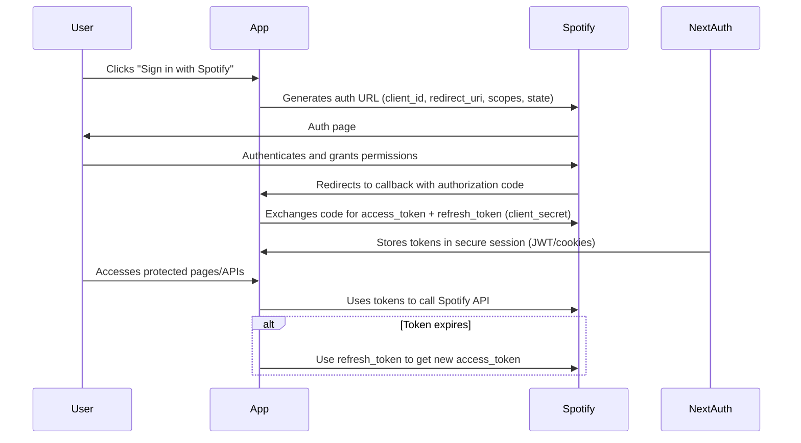

# Spotify OAuth Setup Guide

This document outlines the steps required to set up Spotify OAuth authentication for the AI Playlist Generator project.

## Prerequisites

- A Spotify Developer account (sign up at [Spotify for Developers](https://developer.spotify.com/))
- Node.js and npm/bun installed
- The project dependencies installed (`bun install` or `npm install`)

## Step 1: Create a Spotify Developer Application

1. Go to the [Spotify Developer Dashboard](https://developer.spotify.com/dashboard)
2. Click "Create an App"
3. Fill in the app name (e.g., "AI Playlist Generator") and description
4. Set the redirect URI to: `http://127.0.0.1:3000/api/auth/callback/spotify`
5. Note down the Client ID and Client Secret from the app settings

## Step 2: Configure Environment Variables

1. Copy `.env.sample` to `.env` in the project root
2. Fill in the following variables:
   - `SPOTIFY_CLIENT_ID`: Your Spotify app's Client ID
   - `SPOTIFY_CLIENT_SECRET`: Your Spotify app's Client Secret
   - `SPOTIFY_ENCRYPTION_KEY`: A 64-character hexadecimal encryption key (32 bytes). Generate with `openssl rand -hex 32`
   - `SPOTIFY_REDIRECT_URI`: `http://127.0.0.1:3000/api/auth/callback/spotify`
   - `NEXTAUTH_URL`: `http://127.0.0.1:3000` (for local development)
   - `NEXTAUTH_SECRET`: A secure random string (32+ characters)

To generate a secure NEXTAUTH_SECRET, run:

```bash
openssl rand -base64 32
```

Note: For `SPOTIFY_ENCRYPTION_KEY`, use:

```bash
openssl rand -hex 32
```

## Step 3: Update Spotify App Redirect URIs (if needed)

Ensure that `http://127.0.0.1:3000/api/auth/callback/spotify` is added to the "Redirect URIs" list in your Spotify app settings.

## Step 4: Run the Application

Start the development server using bun (the preferred and recommended tool for this project):

```bash
bun run dev
```

## Step 5: Test the Authentication

1. Navigate to `http://127.0.0.1:3000/auth/signin`
2. Click "Sign in with Spotify"
3. Authorize the application in the Spotify popup
4. You should be redirected back and logged in

## Step 6: Test Logout

1. After logging in, click the "Logout" button in the header or the "Log out" button on the main page
2. You should be logged out and redirected to the home page
3. To log in again, click "Sign in with Spotify" on the home page

## How It Works

- **NextAuth Configuration**: The app uses NextAuth.js with the Spotify provider. For the provider setup and scopes configuration, see [`app/api/auth/[...nextauth]/route.ts`](../app/api/auth/[...nextauth]/route.ts).
- **Scopes**: The app requests the following scopes:
  - `user-read-email`
  - `user-read-private`
  - `user-top-read`
  - `user-read-recently-played`
  - `playlist-read-private`
  - `playlist-read-collaborative`
  - `playlist-modify-public`
  - `playlist-modify-private`
- **Token Management**: Access tokens are automatically refreshed when they expire via the refresh token in the NextAuth callbacks. For more details, see the [Auth.js callbacks documentation](https://authjs.dev/reference/nextjs#callbacks).
- **API Routes**: Protected routes use `getServerSession` to access the user's Spotify tokens

## OAuth Flow Diagram



## Troubleshooting

- **"Invalid redirect URI" error**: Ensure the redirect URI is correctly set in your Spotify app
- **Authentication fails**: Check that all environment variables are set correctly
- **API calls fail**: Verify that the user has granted the necessary permissions

## Production Deployment

For production deployment:

- Update `NEXTAUTH_URL` to your production domain using HTTPS (e.g., `https://yourdomain.com`)
- Update `SPOTIFY_REDIRECT_URI` to the production callback URL (e.g., `https://yourdomain.com/api/auth/callback/spotify`) and add it to your Spotify app's "Redirect URIs"
- Protect environment variables securely in your hosting platform (e.g., set them as secrets in Vercel, Netlify, or similar; never commit `.env` to git)
- Ensure sensitive data like `SPOTIFY_CLIENT_SECRET`, `SPOTIFY_ENCRYPTION_KEY`, and `NEXTAUTH_SECRET` are not exposed in code, logs, or client-side
- Update the Spotify Developer Dashboard with the production redirect URI and verify app settings
