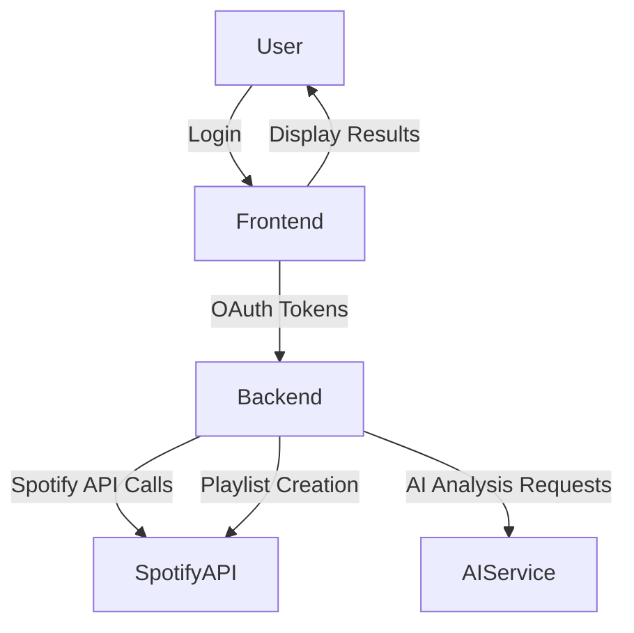

# System Architecture

## Overview

The system is a web application built with Next.js that interacts with Spotify's API and an AI service (OpenAI GPT or similar) to generate personalized playlists. The architecture consists of the following main components:

- **Frontend (Next.js):** Handles user interface, authentication, and interaction with backend services.
- **Backend API Routes (Next.js API):** Acts as a proxy for Spotify API calls and AI service requests, managing authentication tokens and business logic.
- **Spotify API:** Provides access to user playlists, track metadata, and playlist creation.
- **AI Service (OpenAI GPT or similar):** Analyzes user playlists to identify musical taste and generate playlist recommendations.

## Component Diagram

## Data Flow

1. User logs in via Spotify OAuth on the frontend.
2. Frontend sends OAuth tokens to backend API routes.
3. Backend fetches user playlists and track data from Spotify API.
4. Backend sends playlist data to AI service for analysis.
5. AI service returns musical taste insights and playlist recommendations.
6. Backend creates new playlists on Spotify based on AI recommendations.
7. Frontend displays generated playlists and status to the user.

## Key Architectural Decisions

- Use Next.js API routes for backend logic to keep the app serverless and simplify deployment.
- Use OpenAI GPT for AI analysis to leverage powerful language models without building custom ML models.
- Use shadcn UI components for consistent and accessible UI design.
- Store tokens securely in session storage and avoid persistent storage of sensitive data.

## Scalability and Performance

- Backend API routes will handle rate limiting and retries for Spotify API.
- AI requests will be optimized to minimize latency.
- Frontend will use loading states and caching to improve user experience.
