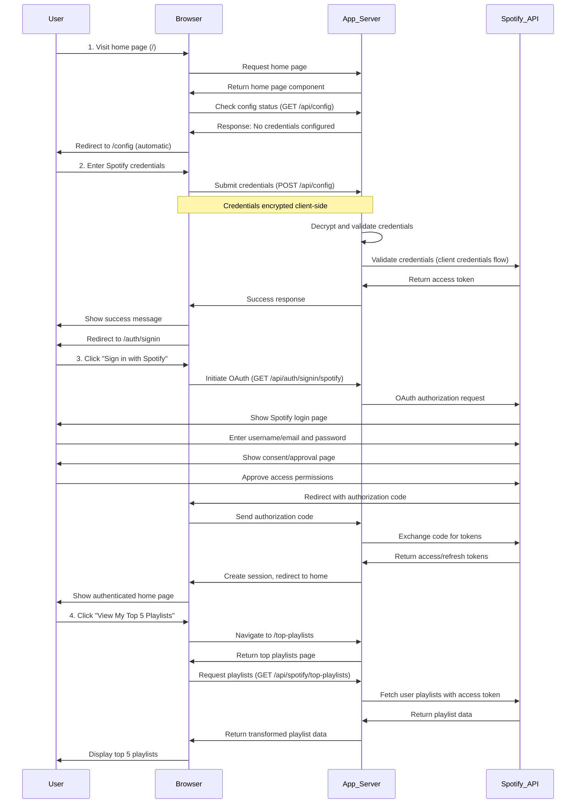

# Full Happy Path to Top Playlists

## Overview

This flow documents the complete end-to-end user journey from a fresh session with no prior configuration to successfully viewing top Spotify playlists. The user starts at the home page, is redirected to configure Spotify credentials, proceeds through Spotify OAuth authentication, and finally accesses their top playlists with full API integration and secure token management.

## Sequence Diagram

## Step-by-Step Flow Description

1. **Initial Home Page Visit**: User navigates to the home page (/) in a fresh session. The app checks for Spotify configuration via the useSpotifyConfig hook, which calls GET /api/config. Since no credentials are configured, the app automatically redirects the user to the configuration page (/config).

2. **Spotify Credentials Configuration**: User enters their Spotify Client ID, Client Secret, and Redirect URI on the configuration page. The credentials are encrypted client-side using ClientCrypto.encryptCredentials() before being sent to POST /api/config. The server decrypts and validates the credentials with Spotify's API using the client credentials flow. Upon successful validation, the user sees a success message and is automatically redirected to the sign-in page (/auth/signin).

3. **Spotify OAuth Authentication**: User clicks "Sign in with Spotify" on the sign-in page. The app initiates the OAuth flow by redirecting to Spotify's authorization endpoint. Spotify displays a login page where the user enters their username/email and password. After successful authentication, Spotify shows a consent page where the user approves the requested permissions. Spotify redirects back to the app with an authorization code, which the server exchanges for access and refresh tokens. A session is created and the user is redirected back to the home page, now authenticated.

4. **Navigation to Top Playlists**: On the authenticated home page, user clicks "View My Top 5 Playlists" button. The app navigates to /top-playlists, which displays a loading state while fetching data.

5. **API Data Fetching**: The top-playlists page component calls GET /api/spotify/top-playlists with the user's access token. The server uses SpotifyProxy.getPlaylists() to fetch the user's playlists from Spotify's API. The response is transformed to include only necessary fields (id, name, description, image, tracks, owner, public status, and external URLs).

6. **Display Top Playlists**: The fetched playlists are displayed in a responsive grid layout. Each playlist card shows the playlist image (or a default Spotify green gradient), name, description, track count, owner, privacy status, and a button to open the playlist directly in Spotify. The user can now interact with their top playlists or navigate back to the home page.
