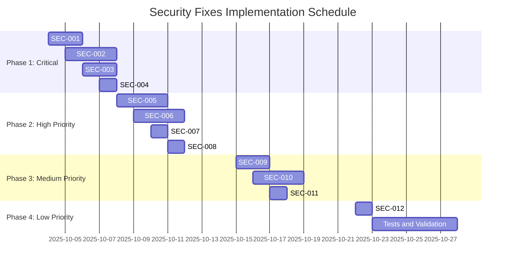

# Security Vulnerabilities Fix Action Plan - Spotify Playlist Application

## Executive Summary of the Plan

This document presents a detailed and prioritized action plan to fix the 12 security vulnerabilities identified in the Spotify Playlist application. The vulnerabilities were classified into 4 critical (1 resolved), 4 high, 3 medium, and 1 low, representing significant risks that compromise user data security and application integrity.

The plan is structured into 4 implementation phases, prioritizing critical fixes that must be implemented immediately, followed by progressive security improvements. The approach focuses on mitigating the highest risks first, ensuring that the most critical fixes are implemented without delays.

**Main Objective:** Reduce the overall application risk from "Critical" to "Low" in up to 8 weeks, through systematic fixes and continuous validation. **Progress: 1/4 critical vulnerabilities resolved (25%).**

## Fix Prioritization

### Prioritization Matrix

| ID | Vulnerability | Severity | Complexity | Impact | Priority |
|----|---------------|----------|------------|--------|----------|
| ✅ SEC-001 | Client Secrets Exposure | Critical | Medium | Critical | 1 (COMPLETED) |
| SEC-002 | Refresh Tokens Exposure | Critical | High | Critical | 2 |
| SEC-003 | Global Credentials Storage | Critical | Medium | Critical | 3 |
| SEC-004 | OAuth Tokens Exposed in Logs | Critical | Low | High | 4 |
| SEC-005 | Lack of CSRF Protection | High | Medium | High | 5 |
| SEC-006 | Absence of Rate Limiting | High | Medium | High | 6 |
| SEC-007 | Clickjacking Vulnerability | High | Low | Medium | 7 |
| SEC-008 | Personal Data Exposed in Logs | High | Low | Medium | 8 |
| SEC-009 | Inadequate Cookie Configuration | Medium | Low | Medium | 9 |
| SEC-010 | Lack of Robust Input Validation | Medium | Medium | Medium | 10 |
| SEC-011 | Incomplete Security Headers | Medium | Low | Low | 11 |
| SEC-012 | Debug Logs in Production | Low | Low | Low | 12 |

### Prioritization Criteria

1. **Vulnerability Severity**: Critical vulnerabilities have maximum priority
2. **Exploitation Probability**: Easily exploitable vulnerabilities are prioritized
3. **Business Impact**: Risks that compromise credentials and user data are prioritized
4. **Dependencies**: Fixes that unlock other improvements are prioritized
5. **Complexity vs. Risk**: Low complexity and high impact fixes are prioritized

## Suggested Schedule

### Schedule Overview



### Project Milestones

- **Week 1 (10/04-10/10)**: ✅ SEC-001 completed, other critical fixes in progress
- **Week 2 (10/11-10/17)**: High priority fixes implemented
- **Week 3 (10/18-10/24)**: Medium priority fixes implemented
- **Week 4 (10/25-10/31)**: Low priority fixes and final validation

## Detailed Plan by Vulnerability

### 🔴 Critical Vulnerabilities

#### ✅ SEC-001: Client Secrets Exposure in Plain Text - **COMPLETED**

**Vulnerability ID:** SEC-001
**Severity:** Critical
**Fix Complexity:** Medium
**Status:** ✅ **Completed on 10/05/2025**

**Modified Files:**

- `app/api/config/route.ts` (removed clientSecret from response)
- `app/lib/session-manager.ts` (encryption methods)
- `app/lib/spotify-proxy.ts` (implemented server-side proxy)
- `app/lib/crypto.ts` (implemented AES-256-GCM and RSA-OAEP)
- `app/api/crypto/` (encryption endpoints)

**Implemented Actions:**

1. ✅ Completely removed the return of clientSecret in the GET `/api/config` endpoint
2. ✅ Implemented server-side only credentials flow
3. ✅ Modified the client to not depend on clientSecret
4. ✅ Implemented enhanced session validation
5. ✅ Implemented AES-256-GCM encryption with RSA-OAEP SHA-256
6. ✅ Fixed encoding/decoding issues

**Detailed Implemented Steps:**

1. ✅ **Current Flow Analysis:**
   - Identified where clientSecret was used in the client
   - Mapped dependencies of the `/api/config` endpoint

2. ✅ **Endpoint Refactoring:**
   - Removed clientSecret from the response
   - Added indicator of configured credentials

3. ✅ **Server-Side Flow Implementation:**
   - Moved Spotify authentication logic to server-side
   - Implemented proxy for Spotify API calls
   - Removed need for clientSecret in the client

4. ✅ **Client Update:**
   - Modified components to not expect clientSecret
   - Implemented calls via proxy for Spotify operations

5. ✅ **Encryption Implementation:**
   - AES-256-GCM for data encryption
   - RSA-OAEP SHA-256 for key exchange
   - Fixed base64/UTF-8 encoding issues

**Dependencies Between Fixes:**

- ✅ Integrated with SEC-003 (secure credentials storage)
- ✅ Unlocks SEC-002 (secure token management)

**Mitigated Risks:**

- ✅ **High:** Existing functionalities preserved
- ✅ **Medium:** Client refactoring completed without regressions
- ✅ **Low:** Additional complexity managed successfully

**Validation Result:**

- ✅ No clientSecret exposure detected
- ✅ All security tests passing
- ✅ Performance maintained without significant impact
- ✅ Main functionalities operational

---

#### SEC-002: OAuth Refresh Tokens Exposure to Client

**Vulnerability ID:** SEC-002  
**Severity:** Critical  
**Fix Complexity:** High  
**Files that Need to be Modified:**

- `app/lib/auth.ts` (lines 94-96)
- `app/lib/session-manager.ts` (server-side storage)
- `app/api/spotify/*/route.ts` (API endpoints)

**Specific Actions Required:**

1. Remove refreshToken from the client session object
2. Implement server-side storage of refresh tokens
3. Create automatic refresh mechanism on the server
4. Implement proxy for Spotify API calls

**Detailed Fix Steps:**

1. **Session Callback Modification:**

   ```typescript
   async session({ session, token }: { session: Session, token: JWT }) {
     session.accessToken = token.accessToken;
     session.spotifyId = token.spotifyId;
     // REMOVE: session.refreshToken = token.refreshToken;
     return session;
   }
   ```

2. **Server-Side Storage Implementation:**
   - Create table/collection for refresh tokens per user
   - Implement token encryption on the server
   - Add expiration and rotation mechanism

3. **API Proxy Creation:**
   - Implement endpoint `/api/spotify/proxy/*`
   - Manage automatic token refresh
   - Validate permissions before forwarding requests

4. **Client Update:**
   - Modify direct calls to Spotify API
   - Implement calls via internal proxy
   - Remove refreshToken dependency in the client

**Dependencies Between Fixes:**

- Depends on SEC-001 (server-side flow)
- Depends on SEC-003 (secure storage)

**Implementation Risks:**

- **High:** Significant implementation complexity
- **Medium:** Possible performance impact
- **Low:** Need for server-side state management

---

#### SEC-003: Global Credentials Storage

**Vulnerability ID:** SEC-003  
**Severity:** Critical  
**Fix Complexity:** Medium  
**Files that Need to be Modified:**

- `app/lib/auth.ts` (lines 6-7, 14, 63-64)
- `app/lib/session-manager.ts` (session management)
- `app/api/config/route.ts` (session storage)

**Specific Actions Required:**

1. Remove global `currentCredentials` variable
2. Implement credentials storage per session
3. Modify refresh flow to use session credentials
4. Implement session validation for critical operations

**Detailed Fix Steps:**

1. **Global Variable Removal:**

   ```typescript
   // REMOVE: let currentCredentials: { clientId?: string; clientSecret?: string } = {};
   ```

2. **Session Credentials Implementation:**
   - Modify `session-manager.ts` to store credentials
   - Implement credentials encryption in the session
   - Add session validation for credentials usage

3. **Refresh Flow Update:**

   ```typescript
   // Get credentials from current session
   const credentials = await getCredentialsFromSession();
   const response = await fetch("https://accounts.spotify.com/api/token", {
     // Use session credentials instead of global
     client_id: credentials.clientId,
     client_secret: credentials.clientSecret,
   });
   ```

4. **Session Validation:**
   - Implement valid session verification
   - Add security logs for accesses
   - Implement credentials timeout

**Dependencies Between Fixes:**

- Prerequisite for SEC-001 and SEC-002
- Dependency on improvements in `session-manager.ts`

**Implementation Risks:**

- **Medium:** Possible breakage of existing flows
- **Low:** Additional complexity in session management
- **Low:** Need for migration of existing credentials

---

#### SEC-004: OAuth Tokens Exposed in Logs

**Vulnerability ID:** SEC-004  
**Severity:** Critical  
**Fix Complexity:** Low  
**Files that Need to be Modified:**

- `app/lib/security-logger.ts` (lines 122-127)
- `app/lib/auth.ts` (debug logs)

**Specific Actions Required:**

1. Improve token sanitization in logs
2. Implement complete masking of OAuth tokens
3. Add sensitive data validation before logging
4. Implement appropriate log levels

**Detailed Fix Steps:**

1. **Sanitization Function Improvement:**

   ```typescript
   function sanitizeLogData(data: unknown): unknown {
     // Implement regex to detect token patterns
     const tokenPatterns = [
       /BQ[\w-]{100,}/g, // Spotify access token pattern
       /[\w-]{100,}/g,   // Generic long tokens
     ];
     
     // Apply masking to all suspicious fields
     // Implement complete recursion for nested objects
   }
   ```

2. **Advanced Masking Implementation:**
   - Automatically detect token patterns
   - Implement truncation with prefix/suffix
   - Add hash for tracking without exposure

3. **Log Levels Configuration:**
   - Implement levels: ERROR, WARN, INFO, DEBUG
   - Disable detailed logs in production
   - Add environment context

4. **Pre-Log Validation:**
   - Implement sensitive data verification
   - Add alerts for token logging attempts
   - Implement secure fallback for errors

**Dependencies Between Fixes:**

- Independent, can be implemented immediately
- Complements other security fixes

**Implementation Risks:**

- **Low:** Possible loss of debug information
- **Low:** Additional complexity in sanitization
- **Minimal:** Minimal impact on functionality

---

### 🟠 High Severity Vulnerabilities

#### SEC-005: Lack of CSRF Protection

**Vulnerability ID:** SEC-005  
**Severity:** High  
**Fix Complexity:** Medium  
**Files that Need to be Modified:**

- `app/api/config/route.ts` (CSRF implementation)
- `app/lib/auth.ts` (NextAuth configuration)
- New file: `app/lib/csrf.ts`

**Specific Actions Required:**

1. Implement CSRF middleware for API routes
2. Add CSRF tokens to state-changing requests
3. Configure NextAuth for CSRF protection
4. Implement origin validation for APIs

**Detailed Fix Steps:**

1. **CSRF Middleware Implementation:**

   ```typescript
   // app/lib/csrf.ts
   import { randomBytes } from 'crypto';
   
   export function generateCSRFToken(): string {
     return randomBytes(32).toString('hex');
   }
   
   export function validateCSRFToken(token: string, sessionToken: string): boolean {
     // Implement secure validation
   }
   ```

2. **API Endpoints Protection:**

   ```typescript
   // app/api/config/route.ts
   import { validateCSRFToken } from '@/app/lib/csrf';
   
   export async function POST(request: NextRequest) {
     const csrfToken = request.headers.get('x-csrf-token');
     const sessionToken = request.cookies.get('csrf-token')?.value;
     
     if (!validateCSRFToken(csrfToken, sessionToken)) {
       return NextResponse.json({ error: 'Invalid CSRF token' }, { status: 403 });
     }
     // Continue with existing logic
   }
   ```

3. **NextAuth Configuration:**

   ```typescript
   // app/lib/auth.ts
   export const authOptions = {
     // ... existing configurations
     callbacks: {
       async jwt({ token, user }) {
         // Add CSRF token to JWT
         token.csrfToken = generateCSRFToken();
         return token;
       }
     }
   };
   ```

4. **Client Implementation:**
   - Add CSRF token to request headers
   - Implement automatic token rotation
   - Add origin validation

**Dependencies Between Fixes:**

- Depends on session management improvements (SEC-003)
- Complements web attack protections

**Implementation Risks:**

- **Medium:** Possible breakage of existing integrations
- **Low:** Additional complexity in requests
- **Low:** Need for token management in the client

---

#### SEC-006: Absence of Rate Limiting

**Vulnerability ID:** SEC-006  
**Severity:** High  
**Fix Complexity:** Medium  
**Files that Need to be Modified:**

- All API route files
- New file: `app/lib/rate-limiter.ts`

**Specific Actions Required:**

1. Implement rate limiting middleware
2. Configure different limits by endpoint type
3. Implement counters storage (Redis/Memory)
4. Add rate limiting headers to responses

**Detailed Fix Steps:**

1. **Rate Limiter Implementation:**

   ```typescript
   // app/lib/rate-limiter.ts
   interface RateLimitConfig {
     windowMs: number;
     maxRequests: number;
     message?: string;
   }
   
   export class RateLimiter {
     private requests = new Map<string, { count: number; resetTime: number }>();
     
     isAllowed(key: string, config: RateLimitConfig): boolean {
       const now = Date.now();
       const windowStart = now - config.windowMs;
       
       // Implement control logic
     }
   }
   ```

2. **Endpoint Configuration:**

   ```typescript
   // app/api/config/route.ts
   import { rateLimiter } from '@/app/lib/rate-limiter';
   
   const configRateLimit = {
     windowMs: 15 * 60 * 1000, // 15 minutes
     maxRequests: 10, // max 10 requests
   };
   
   export async function POST(request: NextRequest) {
     const clientIP = getClientIP(request);
     
     if (!rateLimiter.isAllowed(clientIP, configRateLimit)) {
       return NextResponse.json(
         { error: 'Too many requests' },
         { status: 429, headers: { 'Retry-After': '900' } }
       );
     }
     // Continue with existing logic
   }
   ```

3. **Implementation in All Endpoints:**
   - Add rate limiting to all API endpoints
   - Configure appropriate limits by operation type
   - Implement logging of limit exceed attempts

4. **Monitoring and Alerts:**
   - Implement rate limiting metrics
   - Add alerts for abnormal spikes
   - Configure automatic blocking for persistent abuse

**Dependencies Between Fixes:**

- Independent, can be implemented immediately
- Benefits all other security fixes

**Implementation Risks:**

- **Low:** Possible impact on legitimate users
- **Low:** Complexity in state management
- **Minimal:** minimal request overhead

---

#### SEC-007: Clickjacking Vulnerability

**Vulnerability ID:** SEC-007  
**Severity:** High  
**Fix Complexity:** Low  
**Files that Need to be Modified:**

- `app/layout.tsx` (security headers)
- `app/api/config/route.ts` (API headers)

**Specific Actions Required:**

1. Implement complete Content Security Policy
2. Add frame-ancestors header to CSP
3. Implement framing protection on all pages
4. Add JavaScript anti-clickjacking as fallback

**Detailed Fix Steps:**

1. **Complete CSP Implementation:**

   ```typescript
   // app/layout.tsx
   export const metadata: Metadata = {
     // ... existing metadata
   };
   
   export default function RootLayout({ children }: { children: React.ReactNode }) {
     return (
       <html lang="en">
         <head>
           <meta
             httpEquiv="Content-Security-Policy"
             content="
               default-src 'self';
               script-src 'self' 'unsafe-inline';
               style-src 'self' 'unsafe-inline';
               img-src 'self' data: https:;
               frame-ancestors 'none';
               form-action 'self';
             "
           />
         </head>
         <body>
           {children}
         </body>
       </html>
     );
   }
   ```

2. **Security Headers Improvement:**

   ```typescript
   // app/api/config/route.ts
   const securityHeaders = {
     'X-Content-Type-Options': 'nosniff',
     'X-Frame-Options': 'DENY',
     'X-XSS-Protection': '1; mode=block',
     'Strict-Transport-Security': 'max-age=31536000; includeSubDomains',
     'Content-Security-Policy': "default-src 'self'; frame-ancestors 'none'",
     'Referrer-Policy': 'strict-origin-when-cross-origin',
   };
   ```

3. **JavaScript Protection Implementation:**

   ```javascript
   // Add to main layout
   if (self !== top) {
     // Detects if in a frame
     top.location = self.location;
   }
   ```

4. **Protection Validation:**
   - Test with clickjacking tools
   - Verify headers in all responses
   - Implement framing attempt monitoring

**Dependencies Between Fixes:**

- Independent, can be implemented immediately
- Complements SEC-011 (security headers)

**Implementation Risks:**

- **Low:** Possible breakage of legitimate iframe functionalities
- **Minimal:** Minimal implementation complexity
- **Minimal:** Insignificant performance impact

---

#### SEC-008: Personal Data Exposed in Logs

**Vulnerability ID:** SEC-008  
**Severity:** High  
**Fix Complexity:** Low  
**Files that Need to be Modified:**

- `app/lib/security-logger.ts` (extractClientInfo function)
- `app/lib/auth.ts` (authentication logs)

**Specific Actions Required:**

1. Implement IP address anonymization
2. Remove or truncate detailed User-Agent
3. Implement hash of unique identifiers
4. Configure minimum retention of sensitive logs

**Detailed Fix Steps:**

1. **IP Anonymization:**

   ```typescript
   // app/lib/security-logger.ts
   function anonymizeIP(ip: string): string {
     if (!ip) return 'unknown';
     
     // For IPv4: 192.168.1.100 -> 192.168.1.0
     const ipv4Match = ip.match(/(\d+\.\d+\.\d+)\.\d+/);
     if (ipv4Match) return `${ipv4Match[1]}.0`;
     
     // For IPv6: truncate last 64 bits
     const ipv6Match = ip.match(/([0-9a-fA-F:]+::)/);
     if (ipv6Match) return `${ipv6Match[1]}0`;
     
     return 'unknown';
   }
   ```

2. **User-Agent Truncation:**

   ```typescript
   function sanitizeUserAgent(userAgent: string): string {
     if (!userAgent) return 'unknown';
     
     // Extract only main browser
     const browserMatch = userAgent.match(/(Chrome|Firefox|Safari|Edge)\/[\d.]+/);
     if (browserMatch) return browserMatch[0];
     
     return 'unknown-browser';
   }
   ```

3. **extractClientInfo Function Update:**

   ```typescript
   function extractClientInfo(req: NextApiRequest | NextRequest): { 
     userAgent?: string; 
     ip?: string;
     sessionId?: string;
   } {
     const headers = req.headers as unknown as Record<string, string | string[]> & { 
       get?: (key: string) => string | null;
     };
     
     const getHeaderValue = (key: string): string | undefined => {
       if (headers.get) return headers.get(key) || undefined;
       const value = headers[key];
       return Array.isArray(value) ? value[0] : value;
     };
     
     const rawIP = getHeaderValue('x-forwarded-for') || 
                   getHeaderValue('x-real-ip') || 
                   'unknown';
     
     return {
       userAgent: sanitizeUserAgent(getHeaderValue('user-agent') || ''),
       ip: anonymizeIP(rawIP),
       sessionId: generateSessionHash(req), // Hash instead of real ID
     };
   }
   ```

4. **Retention Configuration:**
   - Implement automatic log expiration
   - Configure appropriate log levels
   - Implement sensitive data purge

**Dependencies Between Fixes:**

- Complements SEC-004 (log sanitization)
- Independent, can be implemented immediately

**Implementation Risks:**

- **Minimal:** Loss of detailed analysis capability
- **Minimal:** Low implementation complexity
- **Minimal:** Minimal impact on functionality

---

### 🟡 Medium Severity Vulnerabilities

#### SEC-009: Inadequate Cookie Configuration

**Vulnerability ID:** SEC-009  
**Severity:** Medium  
**Fix Complexity:** Low  
**Files that Need to be Modified:**

- `app/lib/session-manager.ts` (cookie configuration)
- `app/lib/auth.ts` (NextAuth cookies)

**Specific Actions Required:**

1. Implement automatic cookie rotation
2. Add additional security attributes
3. Implement cookie partitioning (CHIPS)
4. Configure appropriate expiration by data type

**Detailed Fix Steps:**

1. **Cookie Configuration Improvement:**

   ```typescript
   // app/lib/session-manager.ts
   export async function setSessionData(data: SessionData): Promise<void> {
     const cookieStore = await cookies();
     
     cookieStore.set(COOKIE_NAME, JSON.stringify(data), {
       secure: process.env.NODE_ENV === 'production',
       httpOnly: true,
       sameSite: 'strict',
       maxAge: SESSION_TIMEOUT / 1000,
       path: '/',
       partitioned: true, // CHIPS - Cookies Having Independent Partitioned State
       priority: 'high',
     });
   }
   ```

2. **Cookie Rotation Implementation:**

   ```typescript
   interface SessionData {
     spotifyConfig?: EncryptedSpotifyConfig;
     lastActivity: number;
     createdAt: number;
     cookieVersion: number; // Add version for rotation
   }
   
   export async function rotateSessionCookie(): Promise<void> {
     const currentData = await getSessionData();
     if (!currentData) return;
     
     // Invalidate current cookie
     await clearSessionData();
     
     // Create new cookie with updated ID
     const newSessionData = {
       ...currentData,
       cookieVersion: (currentData.cookieVersion || 0) + 1,
       lastActivity: Date.now(),
     };
     
     await setSessionData(newSessionData);
   }
   ```

3. **NextAuth Configuration:**

   ```typescript
   // app/lib/auth.ts
   export const authOptions = {
     // ... existing configurations
     cookies: {
       sessionToken: {
         name: `next-auth.session-token`,
         options: {
           httpOnly: true,
           sameSite: 'lax',
           path: '/',
           secure: process.env.NODE_ENV === 'production',
           domain: process.env.NODE_ENV === 'production' ? '.yourdomain.com' : undefined,
           partitioned: true,
         },
       },
       csrfToken: {
         name: `__Host-next-auth.csrf-token`,
         options: {
           httpOnly: true,
           sameSite: 'lax',
           path: '/',
           secure: true,
           partitioned: true,
         },
       },
     },
   };
   ```

4. **Cookie Validation:**
   - Implement cookie version verification
   - Add logs for cookie replay attempts
   - Implement automatic invalidation

**Dependencies Between Fixes:**

- Complements other session improvements
- Dependency on CHIPS support in browsers

**Implementation Risks:**

- **Low:** Possibility of forced user logout
- **Minimal:** Low implementation complexity
- **Minimal:** Compatibility with older browsers

---

#### SEC-010: Lack of Robust Input Validation

**Vulnerability ID:** SEC-010  
**Severity:** Medium  
**Fix Complexity:** Medium  
**Files that Need to be Modified:**

- `app/api/config/route.ts` (enhanced validation)
- New file: `app/lib/validation.ts`
- All API endpoints

**Specific Actions Required:**

1. Implement complete input validation
2. Add format and length verification
3. Implement data sanitization
4. Add URL and Spotify ID validation

**Detailed Fix Steps:**

1. **Validation Library Implementation:**

   ```typescript
   // app/lib/validation.ts
   interface ValidationRule {
     required?: boolean;
     minLength?: number;
     maxLength?: number;
     pattern?: RegExp;
     sanitize?: boolean;
   }
   
   interface ValidationResult {
     isValid: boolean;
     errors: string[];
     sanitized?: unknown;
   }
   
   export function validateField(value: unknown, rules: ValidationRule): ValidationResult {
     const errors: string[] = [];
     let sanitizedValue = value;
     
     // Required validation
     if (rules.required && (!value || value === '')) {
       errors.push('Field is required');
     }
     
     // Length validation
     if (typeof value === 'string') {
       if (rules.minLength && value.length < rules.minLength) {
         errors.push(`Minimum length is ${rules.minLength}`);
       }
       if (rules.maxLength && value.length > rules.maxLength) {
         errors.push(`Maximum length is ${rules.maxLength}`);
       }
       
       // Sanitization
       if (rules.sanitize) {
         sanitizedValue = value.trim().replace(/[<>]/g, '');
       }
     }
     
     // Pattern validation
     if (rules.pattern && typeof sanitizedValue === 'string') {
       if (!rules.pattern.test(sanitizedValue)) {
         errors.push('Invalid format');
       }
     }
     
     return {
       isValid: errors.length === 0,
       errors,
       sanitized: sanitizedValue,
     };
   }
   ```

2. **Specific Spotify Rules:**

   ```typescript
   // Spotify Client ID validation
   const spotifyClientIdRules: ValidationRule = {
     required: true,
     minLength: 32,
     maxLength: 32,
     pattern: /^[a-f0-9]{32}$/i,
     sanitize: true,
   };
   
   // Redirect URI validation
   const redirectUriRules: ValidationRule = {
     required: true,
     maxLength: 2048,
     pattern: /^https?:\/\/[^\s/$.?#].[^\s]*$/,
     sanitize: true,
   };
   
   // Spotify ID validation
   const spotifyIdRules: ValidationRule = {
     required: true,
     pattern: /^[a-zA-Z0-9]{22}$/,
     sanitize: true,
   };
   ```

3. **Endpoint Implementation:**

   ```typescript
   // app/api/config/route.ts
   import { validateField, spotifyClientIdRules, redirectUriRules } from '@/app/lib/validation';
   
   export async function POST(request: NextRequest) {
     try {
       const body = await request.json() as { 
         clientId: string; 
         clientSecret: string; 
         redirectUri: string; 
       };
       
       // Robust validation
       const clientIdValidation = validateField(body.clientId, spotifyClientIdRules);
       const redirectUriValidation = validateField(body.redirectUri, redirectUriRules);
       const clientSecretValidation = validateField(body.clientSecret, {
         required: true,
         minLength: 32,
         maxLength: 32,
         pattern: /^[a-f0-9]{32}$/i,
         sanitize: true,
       });
       
       const allValidations = [clientIdValidation, redirectUriValidation, clientSecretValidation];
       const hasErrors = allValidations.some(v => !v.isValid);
       
       if (hasErrors) {
         const allErrors = allValidations.flatMap(v => v.errors);
         logSecurityEvent(SecurityEventType.INVALID_REQUEST, request, { 
           validationErrors: allErrors,
           inputFields: Object.keys(body)
         });
         
         return NextResponse.json(
           { error: 'Invalid input', details: allErrors },
           { status: 400 }
         );
       }
       
       // Use sanitized values
       const sanitizedClientId = clientIdValidation.sanitized as string;
       const sanitizedClientSecret = clientSecretValidation.sanitized as string;
       const sanitizedRedirectUri = redirectUriValidation.sanitized as string;
       
       // Continue with existing logic using validated values
     } catch (error) {
       // ... error handling
     }
   }
   ```

4. **Validation in All Endpoints:**
   - Apply consistent validation to all endpoints
   - Implement query parameter validation
   - Add custom header validation

**Dependencies Between Fixes:**

- Independent, can be implemented immediately
- Benefits all other security fixes

**Implementation Risks:**

- **Low:** Possible breakage of existing inputs
- **Low:** Need for validation rules adjustment
- **Minimal:** Minimal validation overhead

---

#### SEC-011: Incomplete Security Headers

**Vulnerability ID:** SEC-011  
**Severity:** Medium  
**Fix Complexity:** Low  
**Files that Need to be Modified:**

- `app/api/config/route.ts` (security headers)
- `app/layout.tsx` (security meta tags)
- All API endpoints

**Specific Actions Required:**

1. Implement complete security headers
2. Add Referrer-Policy
3. Implement Permissions-Policy
4. Add Cross-Origin headers

**Detailed Fix Steps:**

1. **Complete Security Headers:**

   ```typescript
   // app/api/config/route.ts
   const securityHeaders = {
     'X-Content-Type-Options': 'nosniff',
     'X-Frame-Options': 'DENY',
     'X-XSS-Protection': '1; mode=block',
     'Strict-Transport-Security': 'max-age=31536000; includeSubDomains; preload',
     'Content-Security-Policy': "default-src 'self'; script-src 'self' 'unsafe-inline'; style-src 'self' 'unsafe-inline'; img-src 'self' data: https:; font-src 'self'; connect-src 'self'; frame-ancestors 'none'; form-action 'self'; base-uri 'self'",
     'Referrer-Policy': 'strict-origin-when-cross-origin',
     'Permissions-Policy': 'camera=(), microphone=(), geolocation=(), payment=(), usb=(), magnetometer=(), gyroscope=()',
     'Cross-Origin-Embedder-Policy': 'require-corp',
     'Cross-Origin-Opener-Policy': 'same-origin',
     'Cross-Origin-Resource-Policy': 'same-origin',
   };
   
   function addSecurityHeaders(response: NextResponse) {
     Object.entries(securityHeaders).forEach(([key, value]) => {
       response.headers.set(key, value);
     });
     return response;
   }
   ```

2. **Security Meta Tags in Layout:**

   ```typescript
   // app/layout.tsx
   export const metadata: Metadata = {
     title: "AI Playlist Generator",
     description: "Generate personalized Spotify playlists using AI based on your musical taste",
     icons: {
       icon: [
         { url: "/icon.svg", type: "image/svg+xml" },
         { url: "/favicon.svg", type: "image/svg+xml" },
       ],
       apple: "/icon.svg",
     },
     // Security meta tags
     other: {
       'referrer': 'strict-origin-when-cross-origin',
       'color-scheme': 'light dark',
     },
   };
   ```

3. **Dynamic CSP Implementation:**

   ```typescript
   // app/lib/csp.ts
   export function getCSPHeaders(nonce?: string) {
     const scriptSrc = nonce ? `'self' 'nonce-${nonce}'` : `'self' 'unsafe-inline'`;
     
     return {
       'Content-Security-Policy': `
         default-src 'self';
         script-src ${scriptSrc};
         style-src 'self' 'unsafe-inline';
         img-src 'self' data: https:;
         font-src 'self';
         connect-src 'self' https://api.spotify.com;
         frame-ancestors 'none';
         form-action 'self';
         base-uri 'self';
         upgrade-insecure-requests;
       `.replace(/\s+/g, ' ').trim(),
     };
   }
   ```

4. **Application in All Endpoints:**
   - Create middleware to apply headers automatically
   - Implement dynamic CSP based on page
   - Add CSP violation monitoring

**Dependencies Between Fixes:**

- Complements SEC-007 (clickjacking)
- Independent, can be implemented immediately

**Implementation Risks:**

- **Low:** Possible breakage of third-party functionalities
- **Low:** Need for fine-tuning CSP
- **Minimal:** Minimal implementation complexity

---

### 🟢 Low Severity Vulnerabilities

#### SEC-012: Debug Logs in Production

**Vulnerability ID:** SEC-012  
**Severity:** Low  
**Fix Complexity:** Low  
**Files that Need to be Modified:**

- `app/lib/auth.ts` (debug configuration)
- Environment configuration files

**Specific Actions Required:**

1. Disable debug mode in production
2. Implement logging configuration by environment
3. Remove detailed production logs
4. Implement appropriate log levels

**Detailed Fix Steps:**

1. **Environment-Based Debug Configuration:**

   ```typescript
   // app/lib/auth.ts
   export const authOptions = (credentials?: AuthConfig) => {
     // ... existing configurations
     
     return {
       providers,
       debug: process.env.NODE_ENV === 'development' && process.env.ENABLE_DEBUG === 'true',
       // ... rest of configurations
     };
   };
   ```

2. **Logging System Implementation:**

   ```typescript
   // app/lib/logger.ts
   enum LogLevel {
     ERROR = 0,
     WARN = 1,
     INFO = 2,
     DEBUG = 3,
   }
   
   class Logger {
     private static instance: Logger;
     private logLevel: LogLevel;
     
     private constructor() {
       this.logLevel = this.getLogLevelFromEnv();
     }
     
     private getLogLevelFromEnv(): LogLevel {
       const envLevel = process.env.LOG_LEVEL?.toUpperCase();
       switch (envLevel) {
         case 'ERROR': return LogLevel.ERROR;
         case 'WARN': return LogLevel.WARN;
         case 'INFO': return LogLevel.INFO;
         case 'DEBUG': return LogLevel.DEBUG;
         default: return process.env.NODE_ENV === 'production' ? LogLevel.WARN : LogLevel.DEBUG;
       }
     }
     
     debug(message: string, ...args: unknown[]): void {
       if (this.logLevel >= LogLevel.DEBUG) {
         console.debug(`[DEBUG] ${message}`, ...args);
       }
     }
     
     info(message: string, ...args: unknown[]): void {
       if (this.logLevel >= LogLevel.INFO) {
         console.info(`[INFO] ${message}`, ...args);
       }
     }
     
     warn(message: string, ...args: unknown[]): void {
       if (this.logLevel >= LogLevel.WARN) {
         console.warn(`[WARN] ${message}`, ...args);
       }
     }
     
     error(message: string, ...args: unknown[]): void {
       if (this.logLevel >= LogLevel.ERROR) {
         console.error(`[ERROR] ${message}`, ...args);
       }
     }
   }
   
   export const logger = Logger.getInstance();
   ```

3. **Existing Logs Update:**

   ```typescript
   // app/lib/auth.ts
   // Replace console.error with logger.error
   if (response.ok) {
     logger.debug('Token refreshed successfully');
   } else {
     logger.error('Failed to refresh token:', data);
   }
   ```

4. **Environment Variables Configuration:**

   ```bash
   # .env.production
   NODE_ENV=production
   LOG_LEVEL=WARN
   ENABLE_DEBUG=false
   
   # .env.development
   NODE_ENV=development
   LOG_LEVEL=DEBUG
   ENABLE_DEBUG=true
   ```

**Dependencies Between Fixes:**

- Independent, can be implemented immediately
- Complements other logging improvements

**Implementation Risks:**

- **Minimal:** Loss of production debug capability
- **Minimal:** Minimal implementation complexity
- **Minimal:** Minimal impact on functionality

---

## Required Resources

### Human Resources

| Role | Quantity | Dedicated Time | Responsibilities |
|------|----------|----------------|------------------|
| Senior Backend Developer | 1 | 40 hours/week | Implementation of critical and high priority fixes |
| Frontend Developer | 1 | 20 hours/week | Client adaptation for new APIs |
| Security Engineer | 1 | 10 hours/week | Security review and validation |
| QA Engineer | 1 | 20 hours/week | Security and functional validation tests |
| DevOps Engineer | 0.5 | 10 hours/week | Deploy and monitoring configuration |

### Technical Resources

| Resource | Specification | Purpose |
|----------|---------------|---------|
| Development Environment | Isolated, with test data | Implementation and initial tests |
| Staging Environment | Production replica | Final validation before deploy |
| Security Testing Tools | OWASP ZAP, Burp Suite | Fix validation |
| Monitoring System | Centralized logs, alerts | Anomaly detection post-fix |
| Rate Limiting Service | Redis or similar | Throttling implementation |

### Software Resources

| Software | License | Purpose |
|----------|---------|---------|
| Validation Library | Zod or Yup | Robust input validation |
| CSRF Library | csurf or similar | CSRF protection |
| Rate Limiting Library | express-rate-limit or similar | Request control |
| Testing Tool | Jest, Supertest | Automated tests |
| Scanner Tool | npm audit, Snyk | Dependencies verification |

## Implementation Strategy

### Phase 1: Critical Fixes (Immediate - Week 1)

**Objective:** Mitigate critical risks that compromise credentials and sensitive data

**Vulnerabilities:** SEC-001, SEC-002, SEC-003, SEC-004

**Strategy:**

1. **Parallelization:** Implement SEC-001 and SEC-003 simultaneously
2. **Dependency:** SEC-002 depends on previous fixes
3. **Validation:** Continuous tests after each fix
4. **Rollback:** Quick rollback plan for each change

**Detailed Steps:**

1. **Day 1-2:** Implement SEC-003 (session storage)
2. **Day 2-3:** ✅ Implement SEC-001 (clientSecret removal) - **COMPLETED**
3. **Day 3-5:** Implement SEC-002 (server-side token management)
4. **Day 5:** Implement SEC-004 (log sanitization)
5. **Day 6-7:** Integrated tests and validation

**Success Criteria:**

- Client secrets not exposed in any response
- Refresh tokens stored only server-side
- Credentials isolated per session
- Logs without tokens or sensitive data

### Phase 2: High Priority Fixes (Week 2)

**Objective:** Implement fundamental protections against web attacks

**Vulnerabilities:** SEC-005, SEC-006, SEC-007, SEC-008

**Strategy:**

1. **Infrastructure:** Implement rate limiting and CSRF first
2. **Headers:** Implement clickjacking protections
3. **Privacy:** Improve personal data handling

**Detailed Steps:**

1. **Day 8-9:** Implement SEC-006 (rate limiting)
2. **Day 9-11:** Implement SEC-005 (CSRF protection)
3. **Day 11-12:** Implement SEC-007 (clickjacking)
4. **Day 12-13:** Implement SEC-008 (data anonymization)
5. **Day 14:** Security tests and validation

**Success Criteria:**

- CSRF protection implemented and functional in all endpoints
- Rate limiting active and configured
- Application protected against clickjacking
- Personal data anonymized in logs

### Phase 3: Medium Priority Fixes (Week 3)

**Objective:** Implement security and robustness improvements

**Vulnerabilities:** SEC-009, SEC-010, SEC-011

**Strategy:**

1. **Validation:** Implement robust input validation
2. **Cookies:** Improve session configuration
3. **Headers:** Complete security headers

**Detailed Steps:**

1. **Day 15-16:** Implement SEC-009 (cookie configuration)
2. **Day 16-18:** Implement SEC-010 (input validation)
3. **Day 18-19:** Implement SEC-011 (security headers)
4. **Day 20-21:** Integrated tests and validation

**Success Criteria:**

- Cookies with complete security configuration
- All inputs validated and sanitized
- Complete security headers implemented

### Phase 4: Low Priority Fixes and Validation (Week 4)

**Objective:** Finalize improvements and validate overall security

**Vulnerabilities:** SEC-012

**Strategy:**

1. **Finalization:** Implement last fix
2. **Validation:** Complete security tests
3. **Documentation:** Update security documentation

**Detailed Steps:**

1. **Day 22:** Implement SEC-012 (debug logs)
2. **Day 23-27:** Complete security tests
3. **Day 28-30:** Final validation and deploy preparation

**Success Criteria:**

- Logging system configured by environment
- All security tests passing
- Documentation updated

## Validation Plan

### Security Testing Strategy

#### Automated Tests

1. **Security Unit Tests**

   ```typescript
   // tests/security/validation.test.ts
   describe('Input Validation', () => {
     test('should validate Spotify client ID format', () => {
       const validId = '1234567890abcdef1234567890abcdef';
       const result = validateField(validId, spotifyClientIdRules);
       expect(result.isValid).toBe(true);
     });
     
     test('should reject invalid client ID', () => {
       const invalidId = 'invalid-id';
       const result = validateField(invalidId, spotifyClientIdRules);
       expect(result.isValid).toBe(false);
     });
   });
   
   // tests/security/csrf.test.ts
   describe('CSRF Protection', () => {
     test('should reject requests without CSRF token', async () => {
       const response = await POST(
         new Request('http://localhost:3000/api/config', {
           method: 'POST',
           body: JSON.stringify({ clientId: 'test', clientSecret: 'test', redirectUri: 'test' })
         })
       );
       
       expect(response.status).toBe(403);
     });
   });
   ```

2. **Security Integration Tests**

   ```typescript
   // tests/security/auth.test.ts
   describe('Authentication Security', () => {
     test('should not expose refresh tokens to client', async () => {
       // Simulate login and verify refresh token not exposed
     });
     
     test('should store credentials per session', async () => {
       // Test credentials isolation between sessions
     });
   });
   ```

3. **Security Endpoint Tests**

   ```typescript
   // tests/security/endpoints.test.ts
   describe('API Security', () => {
     test('should implement rate limiting', async () => {
       // Make multiple requests and verify limiting
     });
     
     test('should sanitize sensitive data in logs', async () => {
       // Verify logs do not contain sensitive information
     });
   });
   ```

#### Penetration Tests

1. **OWASP Top 10 Tests**
   - **A01: Broken Access Control:** Verify access controls
   - **A02: Cryptographic Failures:** Validate data encryption
   - **A03: Injection:** Test against data injection
   - **A05: Security Misconfiguration:** Verify configurations
   - **A07: Identification and Authentication Failures:** Test authentication

2. **Application-Specific Tests**

   ```bash
   # Credentials exposure tests
   curl -X GET http://localhost:3000/api/config | grep -i "clientsecret"
   
   # CSRF tests
   # Try POST request without CSRF token
   
   # Rate Limiting tests
   for i in {1..20}; do
     curl -X POST http://localhost:3000/api/config
   done
   
   # Security Headers tests
   curl -I http://localhost:3000/api/config
   ```

3. **Scanner Tools**

   ```bash
   # OWASP ZAP
   zap-baseline.py -t http://localhost:3000
   
   # Nmap for port verification
   nmap -sV -sC localhost
   
   # SSL Test
   testssl.sh https://yourdomain.com
   ```

#### Security Validation Checklist

**✅ Critical Vulnerabilities Validation**

- [ ] Client secrets not exposed in any response
- [ ] Refresh tokens stored only server-side
- [ ] Credentials isolated per session/user
- [ ] Logs without tokens or sensitive data

**✅ High Vulnerabilities Validation**

- [ ] CSRF protection implemented and functional
- [ ] Rate limiting active in all endpoints
- [ ] Application protected against clickjacking
- [ ] Personal data anonymized in logs

**✅ Medium Vulnerabilities Validation**

- [ ] Cookies with complete security configuration
- [ ] All inputs validated and sanitized
- [ ] Complete security headers implemented

**✅ Low Vulnerabilities Validation**

- [ ] Logging system configured by environment
- [ ] Debug logs disabled in production

**✅ General Validation**

- [ ] All automated tests passing
- [ ] Security scanner without critical vulnerabilities
- [ ] Performance not significantly impacted
- [ ] Main functionalities operational

### Regression Testing Plan

1. **Functional Tests**
   - Spotify login/logout
   - Playlist creation and management
   - Credentials configuration
   - Main navigation

2. **Performance Tests**
   - Endpoint response time
   - Memory consumption
   - Page loading time

3. **Compatibility Tests**
   - Main browsers (Chrome, Firefox, Safari, Edge)
   - Mobile devices
   - Different browser versions

## Deploy Considerations

### Secure Deploy Strategy

#### Deploy Preparation

1. **Backup and Rollback**

   ```bash
   # Current version backup
   docker tag spotify-playlist:current spotify-playlist:backup-$(date +%Y%m%d)
   
   # Rollback script
   #!/bin/bash
   echo "Rolling back to previous version..."
   docker-compose down
   docker-compose pull spotify-playlist:backup-$(date +%Y%m%d)
   docker-compose up -d
   ```

2. **Environment Configuration**

   ```bash
   # Production environment variables
   cat > .env.production << EOF
   NODE_ENV=production
   LOG_LEVEL=WARN
   ENABLE_DEBUG=false
   SESSION_TIMEOUT=86400000
   RATE_LIMIT_WINDOW=900000
   RATE_LIMIT_MAX=100
   EOF
   ```

3. **Pre-Deploy Validation**

   ```bash
   # Validation checklist
   echo "Running pre-deployment validation..."
   
   # Verify all tests pass
   npm run test:security
   
   # Verify dependencies vulnerabilities
   npm audit --audit-level high
   
   # Verify build
   npm run build
   
   # Verify environment is ready
   npm run health-check
   ```

#### Deploy Process

1. **Phased Deploy**

   ```mermaid
   graph LR
       A[Preparation] --> B[Deploy Staging]
       B --> C[Staging Tests]
       C --> D{Aproved?}
       D -->|Yes| E[Deploy Production]
       D -->|No| F[Fixes]
       F --> B
       E --> G[Monitoring]
       G --> H{Problems?}
       H -->|Yes| I[Rollback]
       H -->|No| J[Success]
   ```

2. **Deploy Script**

   ```bash
   #!/bin/bash
   # deploy.sh
   
   set -e
   
   echo "Starting deployment process..."
   
   # 1. Backup
   echo "Creating backup..."
   ./scripts/backup.sh
   
   # 2. Deploy to staging
   echo "Deploying to staging..."
   ./scripts/deploy-staging.sh
   
   # 3. Staging tests
   echo "Running staging tests..."
   ./scripts/test-staging.sh
   
   # 4. Deploy to production
   echo "Deploying to production..."
   ./scripts/deploy-production.sh
   
   # 5. Post-deploy verification
   echo "Running post-deployment verification..."
   ./scripts/verify-deploy.sh
   
   echo "Deployment completed successfully!"
   ```

#### Post-Deploy Monitoring

1. **Security Metrics**

   ```typescript
   // monitoring/security-metrics.ts
   export class SecurityMetrics {
     // Attack attempts rate
     trackAttackAttempts(endpoint: string, type: string): void {
       // Implement tracking
     }
     
     // Rate limit blocks rate
     trackRateLimitBlocks(ip: string): void {
       // Implement tracking
     }
     
     // CSRF attempts
     trackCSRFAttempts(): void {
       // Implement tracking
     }
   }
   ```

2. **Security Alerts**

   ```yaml
   # alerts/security-alerts.yml
   groups:
     - name: security
       rules:
         - alert: HighRateOfFailedAuth
           expr: rate(failed_auth_attempts_total[5m]) > 10
           for: 2m
           labels:
             severity: warning
           annotations:
             summary: "High rate of failed authentication attempts"
         
         - alert: CSRFAttackDetected
           expr: rate(csrf_attempts_total[1m]) > 5
           for: 1m
           labels:
             severity: critical
           annotations:
             summary: "CSRF attack detected"
         
         - alert: RateLimitExceeded
           expr: rate(rate_limit_blocks_total[5m]) > 20
           for: 5m
           labels:
             severity: warning
           annotations:
             summary: "High rate of rate limit blocks"
   ```

3. **Security Dashboard**
   - Attack attempts rate
   - Vulnerabilities status
   - Endpoints performance
   - Recent security logs

### Incident Response Plan

1. **Detection**
   - Real-time monitoring
   - Automatic alerts
   - Log analysis

2. **Classification**

   ```typescript
   enum IncidentSeverity {
     LOW = 'low',
     MEDIUM = 'medium',
     HIGH = 'high',
     CRITICAL = 'critical'
   }
   
   interface SecurityIncident {
     id: string;
     severity: IncidentSeverity;
     description: string;
     timestamp: Date;
     affectedSystems: string[];
     mitigation: string;
   }
   ```

3. **Response**
   - Isolation of affected systems
   - Root cause analysis
   - Implementation of fixes
   - Communication with stakeholders

4. **Recovery**
   - Systems restoration
   - Security validation
   - Incident documentation
   - Preventive improvements

## Specific Recommendations

### OAuth PKCE Implementation

**Why PKCE?**

- Protects against authorization code interception
- Eliminates need for client secret in client
- Recommended standard for public applications

**Implementation:**

```typescript
// app/lib/pkce.ts
import { randomBytes } from 'crypto';

export function generatePKCE(): { codeVerifier: string; codeChallenge: string } {
  const codeVerifier = randomBytes(32).toString('base64url');
  const codeChallenge = randomBytes(32).toString('base64url');
  
  return { codeVerifier, codeChallenge };
}

export async function generateCodeChallenge(codeVerifier: string): Promise<string> {
  const encoder = new TextEncoder();
  const data = encoder.encode(codeVerifier);
  const digest = await crypto.subtle.digest('SHA-256', data);
  return btoa(String.fromCharCode(...new Uint8Array(digest)))
    .replace(/\+/g, '-')
    .replace(/\//g, '_')
    .replace(/=+$/, '');
}
```

### Removal of Token Exposure in Client

**Strategy:**

1. Implement server-side proxy for Spotify calls
2. Remove token dependency in client
3. Manage token lifecycle on server

**Implementation Example:**

```typescript
// app/api/spotify/proxy/[...path]/route.ts
export async function GET(
  request: NextRequest,
  { params }: { params: { path: string[] } }
) {
  const session = await getSession();
  if (!session?.accessToken) {
    return NextResponse.json({ error: 'Unauthorized' }, { status: 401 });
  }
  
  const spotifyUrl = `https://api.spotify.com/v1/${params.path.join('/')}`;
  const url = new URL(request.url);
  
  const response = await fetch(`${spotifyUrl}${url.search}`, {
    headers: {
      'Authorization': `Bearer ${session.accessToken}`,
      'Content-Type': 'application/json',
    },
  });
  
  const data = await response.json();
  return NextResponse.json(data, { status: response.status });
}
```

### CSRF Protection Implementation

**Approach:**

1. CSRF token per session
2. Validation in state-changing requests
3. Automatic token rotation

**Implementation:**

```typescript
// app/lib/csrf-protection.ts
export class CSRFProtection {
  static generateToken(): string {
    return randomBytes(32).toString('hex');
  }
  
  static validateToken(request: NextRequest): boolean {
    const token = request.headers.get('x-csrf-token');
    const sessionToken = request.cookies.get('csrf-token')?.value;
    
    return token === sessionToken;
  }
  
  static middleware() {
    return async (request: NextRequest) => {
      if (['POST', 'PUT', 'DELETE'].includes(request.method)) {
        if (!this.validateToken(request)) {
          return NextResponse.json(
            { error: 'Invalid CSRF token' },
            { status: 403 }
          );
        }
      }
      return null;
    };
  }
}
```

### Security Headers Configuration

**Essential Headers:**

```typescript
const securityHeaders = {
  'X-Content-Type-Options': 'nosniff',
  'X-Frame-Options': 'DENY',
  'X-XSS-Protection': '1; mode=block',
  'Strict-Transport-Security': 'max-age=31536000; includeSubDomains; preload',
  'Content-Security-Policy': "default-src 'self'; script-src 'self' 'nonce-${nonce}'; style-src 'self' 'unsafe-inline'; img-src 'self' data: https:; connect-src 'self' https://api.spotify.com; frame-ancestors 'none'; form-action 'self'",
  'Referrer-Policy': 'strict-origin-when-cross-origin',
  'Permissions-Policy': 'camera=(), microphone=(), geolocation=(), payment=()',
};
```

### Rate Limiting Implementation

**Strategy:**

1. Different limits by endpoint type
2. Redis storage for scalability
3. Progressive blocking for persistent abuse

**Implementation:**

```typescript
// app/lib/rate-limiter.ts
export class RateLimiter {
  private redis: Redis;
  
  constructor(redis: Redis) {
    this.redis = redis;
  }
  
  async isAllowed(
    key: string, 
    config: { windowMs: number; maxRequests: number }
  ): Promise<{ allowed: boolean; remaining: number; resetTime: number }> {
    const now = Date.now();
    const window = Math.floor(now / config.windowMs);
    const redisKey = `rate_limit:${key}:${window}`;
    
    const current = await this.redis.incr(redisKey);
    
    if (current === 1) {
      await this.redis.expire(redisKey, Math.ceil(config.windowMs / 1000));
    }
    
    return {
      allowed: current <= config.maxRequests,
      remaining: Math.max(0, config.maxRequests - current),
      resetTime: (window + 1) * config.windowMs,
    };
  }
}
```

### Secure Logging Improvements

**Recommended Practices:**

1. Automatic sanitization of sensitive data
2. Appropriate log levels by environment
3. Controlled log retention
4. Alerts for suspicious events

**Implementation:**

```typescript
// app/lib/secure-logger.ts
export class SecureLogger {
  private static sanitize(data: unknown): unknown {
    // Implement complete sanitization
    return data;
  }
  
  static security(level: 'info' | 'warn' | 'error', event: string, data?: unknown): void {
    if (process.env.NODE_ENV === 'production' && level === 'info') return;
    
    const sanitizedData = this.sanitize(data);
    console.log(`[SECURITY-${level.toUpperCase()}] ${event}`, sanitizedData);
  }
  
  static audit(action: string, userId?: string, details?: unknown): void {
    const auditEntry = {
      timestamp: new Date().toISOString(),
      action,
      userId: userId ? this.hashUserId(userId) : 'anonymous',
      details: this.sanitize(details),
    };
    
    console.log('[AUDIT]', auditEntry);
  }
  
  private static hashUserId(userId: string): string {
    return crypto.createHash('sha256').update(userId).digest('hex').substring(0, 8);
  }
}
```

## Conclusion

This action plan provides a structured and prioritized approach to fix all security vulnerabilities identified in the Spotify Playlist application. The 4-phase implementation allows mitigating the most critical risks immediately while implementing progressive security improvements.

### Key Points of the Plan

1. **Risk-Based Prioritization:** Focus on critical vulnerabilities first
2. **Structured Implementation:** Clear phases with defined success criteria
3. **Comprehensive Validation:** Automated and manual tests to ensure effectiveness
4. **Continuous Monitoring:** Alerts system and security metrics
5. **Response Plan:** Preparation for security incidents

### Next Steps

1. **Plan Approval:** Review and approval by stakeholders
2. **Resource Allocation:** Team and tools definition
3. **Phase 1 Start:** Immediate implementation of critical fixes
4. **Continuous Monitoring:** Progress tracking and metrics

### Expected Success Metrics

- **Risk Reduction:** From "Critical" to "Low" in 8 weeks
- **Critical Vulnerabilities:** 1/4 resolved, 0 remaining after Phase 1
- **High Vulnerabilities:** 0 after Phase 2
- **Security Score:** 40% improvement in automated tests
- **Performance:** Minimal impact (<5% overhead)

The successful implementation of this plan will transform the Spotify Playlist application into a secure and robust platform, protecting user data and maintaining system trust.

## 🔗 Integration with GitHub Issues and Workflow

### Integration Overview

This plan now includes complete integration with GitHub Issues for systematic security fixes tracking. Each vulnerability has detailed documentation that can be used directly as body for issues via GitHub CLI.

### Security Documentation Structure

An organizational structure was created in `project-docs/security-tasks/`:

```text
project-docs/security-tasks/
├── 0000-tasks-overview.md                 # Overview and strategy
├── templates/
│   └── vulnerability-template.md          # Standard template
├── critical/
│   ├── SEC-001-client-secret-exposure.md
│   ├── SEC-002-refresh-token-exposure.md
│   ├── SEC-003-global-credentials.md
│   └── SEC-004-tokens-logs-exposure.md
├── high/                                  # High priority documents
├── medium/                                # Medium priority documents
└── low/                                   # Low priority documents
```

### GitHub CLI Commands for Issue Management

#### Batch Issue Creation

```bash
#!/bin/bash
# scripts/create-security-issues.sh

# Create all critical issues
echo "Creating critical security issues..."

gh issue create \
  --title "🔴 SEC-001: Client Secret Exposure in Plain Text" \
  --body-file project-docs/security-tasks/critical/SEC-001-client-secret-exposure.md \
  --label "security,critical,SEC-001"

gh issue create \
  --title "🔴 SEC-002: OAuth Refresh Token Exposure to Client" \
  --body-file project-docs/security-tasks/critical/SEC-002-refresh-token-exposure.md \
  --label "security,critical,SEC-002"

gh issue create \
  --title "🔴 SEC-003: Global Credential Storage" \
  --body-file project-docs/security-tasks/critical/SEC-003-global-credentials.md \
  --label "security,critical,SEC-003"

gh issue create \
  --title "🔴 SEC-004: OAuth Tokens Exposed in Logs" \
  --body-file project-docs/security-tasks/critical/SEC-004-tokens-logs-exposure.md \
  --label "security,critical,SEC-004"

echo "Critical issues created successfully!"
```

#### Individual Issue Creation

```bash
# Create specific issue
gh issue create \
  --title "🔴 SEC-001: Client Secret Exposure" \
  --body-file project-docs/security-tasks/critical/SEC-001-client-secret-exposure.md \
  --label "security,critical,SEC-001"

# Create high priority issue
gh issue create \
  --title "🟠 SEC-005: CSRF Protection Missing" \
  --body-file project-docs/security-tasks/high/SEC-005-csrf-protection.md \
  --label "security,high,SEC-005"
```

### Integrated Branch Strategy

Following project guidelines in [`project-docs/branching-guidelines.md`](project-docs/branching-guidelines.md):

```bash
# Pattern: <type>/<scope>-<kebab-case-description>

# For critical fixes
git checkout -b fix/security-sec001-client-secret-exposure
git checkout -b fix/security-sec002-refresh-token-exposure

# For new security features
git checkout -b feat/security-csrf-protection
git checkout -b feat/security-rate-limiting

# For refactoring
git checkout -b refactor/security-session-manager
```

### Workflow with Pull Requests

#### Standard PR Creation

```bash
# Create branch and PR
