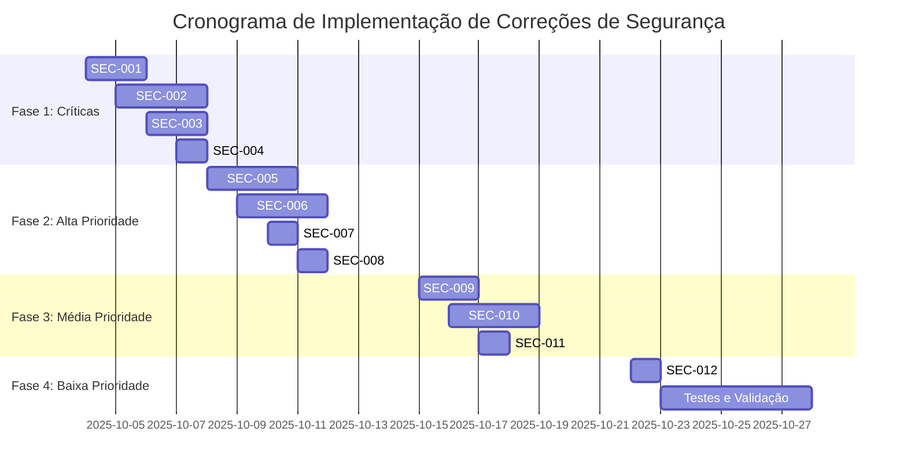

# Plano de Ação para Correção de Vulnerabilidades de Segurança - Aplicação Spotify Playlist

## Resumo Executivo do Plano

Este documento apresenta um plano de ação detalhado e priorizado para corrigir as 12 vulnerabilidades de segurança identificadas na aplicação Spotify Playlist. As vulnerabilidades foram classificadas em 4 críticas, 4 altas, 3 médias e 1 baixa, representando riscos significativos que comprometem a segurança dos dados dos usuários e a integridade da aplicação.

O plano está estruturado em 4 fases de implementação, priorizando correções críticas que devem ser implementadas imediatamente, seguidas por melhorias progressivas de segurança. A abordagem foca em mitigar os riscos mais altos primeiro, garantindo que as correções mais críticas sejam implementadas sem atrasos.

**Objetivo Principal:** Reduzir o risco geral da aplicação de "Crítico" para "Baixo" em até 8 semanas, através de correções sistemáticas e validação contínua.

## Priorização de Correções

### Matriz de Priorização

| ID | Vulnerabilidade | Severidade | Complexidade | Impacto | Prioridade |
|----|-----------------|------------|--------------|---------|------------|
| SEC-001 | Exposição de Client Secrets | Crítica | Média | Crítico | 1 |
| SEC-002 | Exposição de Refresh Tokens | Crítica | Alta | Crítico | 2 |
| SEC-003 | Armazenamento Global de Credenciais | Crítica | Média | Crítico | 3 |
| SEC-004 | Tokens OAuth Expostos nos Logs | Crítica | Baixa | Alto | 4 |
| SEC-005 | Falta de Proteção CSRF | Alta | Média | Alto | 5 |
| SEC-006 | Ausência de Rate Limiting | Alta | Média | Alto | 6 |
| SEC-007 | Vulnerabilidade de Clickjacking | Alta | Baixa | Médio | 7 |
| SEC-008 | Dados Pessoais Expostos nos Logs | Alta | Baixa | Médio | 8 |
| SEC-009 | Configuração Inadequada de Cookies | Média | Baixa | Médio | 9 |
| SEC-010 | Falta de Validação de Input Robusta | Média | Média | Médio | 10 |
| SEC-011 | Headers de Segurança Incompletos | Média | Baixa | Baixo | 11 |
| SEC-012 | Logs de Debug em Produção | Baixa | Baixa | Baixo | 12 |

### Critérios de Priorização

1. **Severidade da Vulnerabilidade**: Vulnerabilidades críticas têm prioridade máxima
2. **Probabilidade de Exploração**: Vulnerabilidades facilmente exploráveis são priorizadas
3. **Impacto no Negócio**: Riscos que comprometem credenciais e dados de usuários são priorizados
4. **Dependências**: Correções que desbloqueiam outras melhorias são priorizadas
5. **Complexidade vs. Risco**: Correções de baixa complexidade e alto impacto são priorizadas

## Cronograma Sugerido

### Visão Geral do Cronograma



### Marcos do Projeto

- **Semana 1 (04-10/10)**: Correções críticas implementadas
- **Semana 2 (11-17/10)**: Correções de alta prioridade implementadas
- **Semana 3 (18-24/10)**: Correções de média prioridade implementadas
- **Semana 4 (25-31/10)**: Correções de baixa prioridade e validação final

## Plano Detalhado por Vulnerabilidade

### 🔴 Vulnerabilidades Críticas

#### SEC-001: Exposição de Client Secrets em Texto Plano

**ID da Vulnerabilidade:** SEC-001  
**Severidade:** Crítica  
**Complexidade da Correção:** Média  
**Arquivos que Precisam ser Modificados:**

- `app/api/config/route.ts` (linhas 73-74, 84-86)
- `app/lib/session-manager.ts` (métodos de criptografia)

**Ações Específicas Necessárias:**

1. Remover completamente o retorno de clientSecret no endpoint GET `/api/config`
2. Implementar fluxo de credenciais server-side apenas
3. Modificar o cliente para não depender de clientSecret
4. Implementar validação aprimorada de sessão

**Passos Detalhados para Correção:**

1. **Análise do Fluxo Atual:**
   - Identificar onde o clientSecret é utilizado no cliente
   - Mapear dependências do endpoint `/api/config`

2. **Refatoração do Endpoint:**

   ```typescript
   // Remover clientSecret da resposta
   const response = NextResponse.json({
     clientId: config?.clientId || "",
     redirectUri: config?.redirectUri || "",
     hasCredentials: !!config
   });
   ```

3. **Implementação de Fluxo Server-Side:**
   - Mover lógica de autenticação Spotify para server-side
   - Implementar proxy para chamadas à API Spotify
   - Remover necessidade de clientSecret no cliente

4. **Atualização do Cliente:**
   - Modificar componentes para não esperar clientSecret
   - Implementar chamadas via proxy para operações Spotify

**Dependências entre Correções:**

- Depende de SEC-003 (armazenamento seguro de credenciais)
- Desbloqueia SEC-002 (gestão segura de tokens)

**Riscos da Implementação:**

- **Alto:** Quebra de funcionalidades existentes
- **Médio:** Necessidade de refatoração significativa do cliente
- **Baixo:** Complexidade adicional no gerenciamento de sessão

---

#### SEC-002: Exposição de Refresh Tokens OAuth ao Cliente

**ID da Vulnerabilidade:** SEC-002  
**Severidade:** Crítica  
**Complexidade da Correção:** Alta  
**Arquivos que Precisam ser Modificados:**

- `app/lib/auth.ts` (linhas 94-96)
- `app/lib/session-manager.ts` (armazenamento server-side)
- `app/api/spotify/*/route.ts` (endpoints de API)

**Ações Específicas Necessárias:**

1. Remover refreshToken do objeto de sessão do cliente
2. Implementar armazenamento server-side de refresh tokens
3. Criar mecanismo de refresh automático no servidor
4. Implementar proxy para chamadas à API Spotify

**Passos Detalhados para Correção:**

1. **Modificação do Callback de Sessão:**

   ```typescript
   async session({ session, token }: { session: Session, token: JWT }) {
     session.accessToken = token.accessToken;
     session.spotifyId = token.spotifyId;
     // REMOVER: session.refreshToken = token.refreshToken;
     return session;
   }
   ```

2. **Implementação de Armazenamento Server-Side:**
   - Criar tabela/coleção para refresh tokens por usuário
   - Implementar criptografia de tokens no servidor
   - Adicionar mecanismo de expiração e rotação

3. **Criação de Proxy API:**
   - Implementar endpoint `/api/spotify/proxy/*`
   - Gerenciar refresh automático de tokens
   - Validar permissões antes de encaminhar requisições

4. **Atualização do Cliente:**
   - Modificar chamadas diretas à API Spotify
   - Implementar chamadas via proxy interno
   - Remover dependência de refreshToken no cliente

**Dependências entre Correções:**

- Depende de SEC-001 (fluxo server-side)
- Depende de SEC-003 (armazenamento seguro)

**Riscos da Implementação:**

- **Alto:** Complexidade significativa de implementação
- **Médio:** Possível impacto de performance
- **Baixo:** Necessidade de gerenciamento de estado no servidor

---

#### SEC-003: Armazenamento Global de Credenciais

**ID da Vulnerabilidade:** SEC-003  
**Severidade:** Crítica  
**Complexidade da Correção:** Média  
**Arquivos que Precisam ser Modificados:**

- `app/lib/auth.ts` (linhas 6-7, 14, 63-64)
- `app/lib/session-manager.ts` (gestão por sessão)
- `app/api/config/route.ts` (armazenamento por sessão)

**Ações Específicas Necessárias:**

1. Remover variável global `currentCredentials`
2. Implementar armazenamento de credenciais por sessão
3. Modificar fluxo de refresh para usar credenciais da sessão
4. Implementar validação de sessão para operações críticas

**Passos Detalhados para Correção:**

1. **Remoção de Variável Global:**

   ```typescript
   // REMOVER: let currentCredentials: { clientId?: string; clientSecret?: string } = {};
   ```

2. **Implementação de Credenciais por Sessão:**
   - Modificar `session-manager.ts` para armazenar credenciais
   - Implementar criptografia de credenciais na sessão
   - Adicionar validação de sessão para uso de credenciais

3. **Atualização do Fluxo de Refresh:**

   ```typescript
   // Obter credenciais da sessão atual
   const credentials = await getCredentialsFromSession();
   const response = await fetch("https://accounts.spotify.com/api/token", {
     // Usar credenciais da sessão em vez de globais
     client_id: credentials.clientId,
     client_secret: credentials.clientSecret,
   });
   ```

4. **Validação de Sessão:**
   - Implementar verificação de sessão válida
   - Adicionar logs de segurança para acessos
   - Implementar timeout de credenciais

**Dependências entre Correções:**

- Pré-requisito para SEC-001 e SEC-002
- Dependência de melhorias em `session-manager.ts`

**Riscos da Implementação:**

- **Médio:** Possível quebra de fluxos existentes
- **Baixo:** Complexidade adicional na gestão de sessão
- **Baixo:** Necessidade de migração de credenciais existentes

---

#### SEC-004: Tokens OAuth Expostos nos Logs

**ID da Vulnerabilidade:** SEC-004  
**Severidade:** Crítica  
**Complexidade da Correção:** Baixa  
**Arquivos que Precisam ser Modificados:**

- `app/lib/security-logger.ts` (linhas 122-127)
- `app/lib/auth.ts` (logs de debug)

**Ações Específicas Necessárias:**

1. Melhorar sanitização de tokens nos logs
2. Implementar mascaramento completo de tokens OAuth
3. Adicionar validação de dados sensíveis antes do log
4. Implementar níveis de log apropriados

**Passos Detalhados para Correção:**

1. **Melhoria da Função de Sanitização:**

   ```typescript
   function sanitizeLogData(data: unknown): unknown {
     // Implementar regex para detectar padrões de token
     const tokenPatterns = [
       /BQ[\w-]{100,}/g, // Spotify access token pattern
       /[\w-]{100,}/g,   // Generic long tokens
     ];
     
     // Aplicar mascaramento em todos os campos suspeitos
     // Implementar recursão completa para objetos aninhados
   }
   ```

2. **Implementação de Mascaramento Avançado:**
   - Detectar automaticamente padrões de token
   - Implementar truncamento com prefixo/sufixo
   - Adicionar hash para rastreamento sem exposição

3. **Configuração de Níveis de Log:**
   - Implementar níveis: ERROR, WARN, INFO, DEBUG
   - Desabilitar logs detalhados em produção
   - Adicionar contexto de ambiente

4. **Validação Pré-Log:**
   - Implementar verificação de dados sensíveis
   - Adicionar alertas para tentativas de log de tokens
   - Implementar fallback seguro para erros

**Dependências entre Correções:**

- Independente, pode ser implementado imediatamente
- Complementa outras correções de segurança

**Riscos da Implementação:**

- **Baixo:** Possível perda de informação para debug
- **Baixo:** Complexidade adicional na sanitização
- **Mínimo:** Impacto mínimo na funcionalidade

---

### 🟠 Vulnerabilidades de Alta Severidade

#### SEC-005: Falta de Proteção CSRF

**ID da Vulnerabilidade:** SEC-005  
**Severidade:** Alta  
**Complexidade da Correção:** Média  
**Arquivos que Precisam ser Modificados:**

- `app/api/config/route.ts` (implementação CSRF)
- `app/lib/auth.ts` (configuração NextAuth)
- Novo arquivo: `app/lib/csrf.ts`

**Ações Específicas Necessárias:**

1. Implementar middleware CSRF para API routes
2. Adicionar tokens CSRF às requisições state-changing
3. Configurar NextAuth para proteção CSRF
4. Implementar validação de origem para APIs

**Passos Detalhados para Correção:**

1. **Implementação de Middleware CSRF:**

   ```typescript
   // app/lib/csrf.ts
   import { randomBytes } from 'crypto';
   
   export function generateCSRFToken(): string {
     return randomBytes(32).toString('hex');
   }
   
   export function validateCSRFToken(token: string, sessionToken: string): boolean {
     // Implementar validação segura
   }
   ```

2. **Proteção de Endpoints API:**

   ```typescript
   // app/api/config/route.ts
   import { validateCSRFToken } from '@/app/lib/csrf';
   
   export async function POST(request: NextRequest) {
     const csrfToken = request.headers.get('x-csrf-token');
     const sessionToken = request.cookies.get('csrf-token')?.value;
     
     if (!validateCSRFToken(csrfToken, sessionToken)) {
       return NextResponse.json({ error: 'Invalid CSRF token' }, { status: 403 });
     }
     // Continuar com lógica existente
   }
   ```

3. **Configuração NextAuth:**

   ```typescript
   // app/lib/auth.ts
   export const authOptions = {
     // ... configurações existentes
     callbacks: {
       async jwt({ token, user }) {
         // Adicionar token CSRF ao JWT
         token.csrfToken = generateCSRFToken();
         return token;
       }
     }
   };
   ```

4. **Implementação no Cliente:**
   - Adicionar token CSRF aos headers de requisições
   - Implementar rotação automática de tokens
   - Adicionar validação de origem

**Dependências entre Correções:**

- Depende de melhorias na gestão de sessão (SEC-003)
- Complementa proteções contra ataques web

**Riscos da Implementação:**

- **Médio:** Possível quebra de integrações existentes
- **Baixo:** Complexidade adicional nas requisições
- **Baixo:** Necessidade de gestão de tokens no cliente

---

#### SEC-006: Ausência de Rate Limiting

**ID da Vulnerabilidade:** SEC-006  
**Severidade:** Alta  
**Complexidade da Correção:** Média  
**Arquivos que Precisam ser Modificados:**

- Todos os arquivos de API routes
- Novo arquivo: `app/lib/rate-limiter.ts`

**Ações Específicas Necessárias:**

1. Implementar middleware de rate limiting
2. Configurar limites diferentes por tipo de endpoint
3. Implementar armazenamento de contadores (Redis/Memory)
4. Adicionar headers de rate limiting às respostas

**Passos Detalhados para Correção:**

1. **Implementação do Rate Limiter:**

   ```typescript
   // app/lib/rate-limiter.ts
   interface RateLimitConfig {
     windowMs: number;
     maxRequests: number;
     message?: string;
   }
   
   export class RateLimiter {
     private requests = new Map<string, { count: number; resetTime: number }>();
     
     isAllowed(key: string, config: RateLimitConfig): boolean {
       const now = Date.now();
       const windowStart = now - config.windowMs;
       
       // Implementar lógica de controle
     }
   }
   ```

2. **Configuração por Endpoint:**

   ```typescript
   // app/api/config/route.ts
   import { rateLimiter } from '@/app/lib/rate-limiter';
   
   const configRateLimit = {
     windowMs: 15 * 60 * 1000, // 15 minutos
     maxRequests: 10, // máximo 10 requisições
   };
   
   export async function POST(request: NextRequest) {
     const clientIP = getClientIP(request);
     
     if (!rateLimiter.isAllowed(clientIP, configRateLimit)) {
       return NextResponse.json(
         { error: 'Too many requests' },
         { status: 429, headers: { 'Retry-After': '900' } }
       );
     }
     // Continuar com lógica existente
   }
   ```

3. **Implementação em Todos os Endpoints:**
   - Adicionar rate limiting a todos os endpoints API
   - Configurar limites apropriados por tipo de operação
   - Implementar logging de tentativas de exceder limites

4. **Monitoramento e Alertas:**
   - Implementar métricas de rate limiting
   - Adicionar alertas para picos anormais
   - Configurar bloqueio automático para abusos persistentes

**Dependências entre Correções:**

- Independente, pode ser implementado imediatamente
- Beneficia todas as outras correções de segurança

**Riscos da Implementação:**

- **Baixo:** Possível impacto em usuários legítimos
- **Baixo:** Complexidade no gerenciamento de estado
- **Mínimo:** overhead mínimo nas requisições

---

#### SEC-007: Vulnerabilidade de Clickjacking

**ID da Vulnerabilidade:** SEC-007  
**Severidade:** Alta  
**Complexidade da Correção:** Baixa  
**Arquivos que Precisam ser Modificados:**

- `app/layout.tsx` (headers de segurança)
- `app/api/config/route.ts` (headers de API)

**Ações Específicas Necessárias:**

1. Implementar Content Security Policy completo
2. Adicionar header frame-ancestors ao CSP
3. Implementar proteção contra framing em todas as páginas
4. Adicionar JavaScript anti-clickjacking como fallback

**Passos Detalhados para Correção:**

1. **Implementação de CSP Completo:**

   ```typescript
   // app/layout.tsx
   export const metadata: Metadata = {
     // ... metadata existente
   };
   
   export default function RootLayout({ children }: { children: React.ReactNode }) {
     return (
       <html lang="en">
         <head>
           <meta
             httpEquiv="Content-Security-Policy"
             content="
               default-src 'self';
               script-src 'self' 'unsafe-inline';
               style-src 'self' 'unsafe-inline';
               img-src 'self' data: https:;
               frame-ancestors 'none';
               form-action 'self';
             "
           />
         </head>
         <body>
           {children}
         </body>
       </html>
     );
   }
   ```

2. **Melhoria dos Headers de Segurança:**

   ```typescript
   // app/api/config/route.ts
   const securityHeaders = {
     'X-Content-Type-Options': 'nosniff',
     'X-Frame-Options': 'DENY',
     'X-XSS-Protection': '1; mode=block',
     'Strict-Transport-Security': 'max-age=31536000; includeSubDomains',
     'Content-Security-Policy': "default-src 'self'; frame-ancestors 'none'",
     'Referrer-Policy': 'strict-origin-when-cross-origin',
   };
   ```

3. **Implementação de Proteção JavaScript:**

   ```javascript
   // Adicionar ao layout principal
   if (self !== top) {
     // Detecta se está em um frame
     top.location = self.location;
   }
   ```

4. **Validação de Proteção:**
   - Testar com ferramentas de clickjacking
   - Verificar headers em todas as respostas
   - Implementar monitoramento de tentativas de framing

**Dependências entre Correções:**

- Independente, pode ser implementado imediatamente
- Complementa SEC-011 (headers de segurança)

**Riscos da Implementação:**

- **Baixo:** Possível quebra de funcionalidades legítimas de iframe
- **Mínimo:** Complexidade mínima de implementação
- **Mínimo:** Impacto insignificante na performance

---

#### SEC-008: Dados Pessoais Expostos nos Logs

**ID da Vulnerabilidade:** SEC-008  
**Severidade:** Alta  
**Complexidade da Correção:** Baixa  
**Arquivos que Precisam ser Modificados:**

- `app/lib/security-logger.ts` (função extractClientInfo)
- `app/lib/auth.ts` (logs de autenticação)

**Ações Específicas Necessárias:**

1. Implementar anonimização de endereços IP
2. Remover ou truncar User-Agent detalhado
3. Implementar hash de identificadores únicos
4. Configurar retenção mínima de logs sensíveis

**Passos Detalhados para Correção:**

1. **Anonimização de IP:**

   ```typescript
   // app/lib/security-logger.ts
   function anonymizeIP(ip: string): string {
     if (!ip) return 'unknown';
     
     // Para IPv4: 192.168.1.100 -> 192.168.1.0
     const ipv4Match = ip.match(/(\d+\.\d+\.\d+)\.\d+/);
     if (ipv4Match) return `${ipv4Match[1]}.0`;
     
     // Para IPv6: truncar últimos 64 bits
     const ipv6Match = ip.match(/([0-9a-fA-F:]+::)/);
     if (ipv6Match) return `${ipv6Match[1]}0`;
     
     return 'unknown';
   }
   ```

2. **Truncamento de User-Agent:**

   ```typescript
   function sanitizeUserAgent(userAgent: string): string {
     if (!userAgent) return 'unknown';
     
     // Extrair apenas navegador principal
     const browserMatch = userAgent.match(/(Chrome|Firefox|Safari|Edge)\/[\d.]+/);
     if (browserMatch) return browserMatch[0];
     
     return 'unknown-browser';
   }
   ```

3. **Atualização da Função extractClientInfo:**

   ```typescript
   function extractClientInfo(req: NextApiRequest | NextRequest): { 
     userAgent?: string; 
     ip?: string;
     sessionId?: string;
   } {
     const headers = req.headers as unknown as Record<string, string | string[]> & { 
       get?: (key: string) => string | null;
     };
     
     const getHeaderValue = (key: string): string | undefined => {
       if (headers.get) return headers.get(key) || undefined;
       const value = headers[key];
       return Array.isArray(value) ? value[0] : value;
     };
     
     const rawIP = getHeaderValue('x-forwarded-for') || 
                   getHeaderValue('x-real-ip') || 
                   'unknown';
     
     return {
       userAgent: sanitizeUserAgent(getHeaderValue('user-agent') || ''),
       ip: anonymizeIP(rawIP),
       sessionId: generateSessionHash(req), // Hash em vez de ID real
     };
   }
   ```

4. **Configuração de Retenção:**
   - Implementar expiração automática de logs
   - Configurar níveis de log apropriados
   - Implementar purge de dados sensíveis

**Dependências entre Correções:**

- Complementa SEC-004 (sanitização de logs)
- Independente, pode ser implementado imediatamente

**Riscos da Implementação:**

- **Mínimo:** Perda de capacidade de análise detalhada
- **Mínimo:** Complexidade baixa de implementação
- **Mínimo:** Impacto mínimo na funcionalidade

---

### 🟡 Vulnerabilidades de Média Severidade

#### SEC-009: Configuração Inadequada de Cookies

**ID da Vulnerabilidade:** SEC-009  
**Severidade:** Média  
**Complexidade da Correção:** Baixa  
**Arquivos que Precisam ser Modificados:**

- `app/lib/session-manager.ts` (configuração de cookies)
- `app/lib/auth.ts` (cookies NextAuth)

**Ações Específicas Necessárias:**

1. Implementar rotação automática de cookies
2. Adicionar atributos de segurança adicionais
3. Implementar particionamento de cookies (CHIPS)
4. Configurar expiração adequada por tipo de dado

**Passos Detalhados para Correção:**

1. **Melhoria da Configuração de Cookies:**

   ```typescript
   // app/lib/session-manager.ts
   export async function setSessionData(data: SessionData): Promise<void> {
     const cookieStore = await cookies();
     
     cookieStore.set(COOKIE_NAME, JSON.stringify(data), {
       secure: process.env.NODE_ENV === 'production',
       httpOnly: true,
       sameSite: 'strict',
       maxAge: SESSION_TIMEOUT / 1000,
       path: '/',
       partitioned: true, // CHIPS - Cookies Having Independent Partitioned State
       priority: 'high',
     });
   }
   ```

2. **Implementação de Rotação de Cookies:**

   ```typescript
   interface SessionData {
     spotifyConfig?: EncryptedSpotifyConfig;
     lastActivity: number;
     createdAt: number;
     cookieVersion: number; // Adicionar versão para rotação
   }
   
   export async function rotateSessionCookie(): Promise<void> {
     const currentData = await getSessionData();
     if (!currentData) return;
     
     // Invalidar cookie atual
     await clearSessionData();
     
     // Criar novo cookie com ID atualizado
     const newSessionData = {
       ...currentData,
       cookieVersion: (currentData.cookieVersion || 0) + 1,
       lastActivity: Date.now(),
     };
     
     await setSessionData(newSessionData);
   }
   ```

3. **Configuração NextAuth:**

   ```typescript
   // app/lib/auth.ts
   export const authOptions = {
     // ... configurações existentes
     cookies: {
       sessionToken: {
         name: `next-auth.session-token`,
         options: {
           httpOnly: true,
           sameSite: 'lax',
           path: '/',
           secure: process.env.NODE_ENV === 'production',
           domain: process.env.NODE_ENV === 'production' ? '.yourdomain.com' : undefined,
           partitioned: true,
         },
       },
       csrfToken: {
         name: `__Host-next-auth.csrf-token`,
         options: {
           httpOnly: true,
           sameSite: 'lax',
           path: '/',
           secure: true,
           partitioned: true,
         },
       },
     },
   };
   ```

4. **Validação de Cookies:**
   - Implementar verificação de versão de cookie
   - Adicionar logs para tentativas de cookie replay
   - Implementar invalidação automática

**Dependências entre Correções:**

- Complementa outras melhorias de sessão
- Dependência de suporte a CHIPS nos navegadores

**Riscos da Implementação:**

- **Baixo:** Possibilidade de logout forçado de usuários
- **Mínimo:** Complexidade baixa de implementação
- **Mínimo:** Compatibilidade com navegadores mais antigos

---

#### SEC-010: Falta de Validação de Input Robusta

**ID da Vulnerabilidade:** SEC-010  
**Severidade:** Média  
**Complexidade da Correção:** Média  
**Arquivos que Precisam ser Modificados:**

- `app/api/config/route.ts` (validação aprimorada)
- Novo arquivo: `app/lib/validation.ts`
- Todos os endpoints API

**Ações Específicas Necessárias:**

1. Implementar validação completa de inputs
2. Adicionar verificação de formato e comprimento
3. Implementar sanitização de dados
4. Adicionar validação de URLs e IDs do Spotify

**Passos Detalhados para Correção:**

1. **Implementação de Biblioteca de Validação:**

   ```typescript
   // app/lib/validation.ts
   interface ValidationRule {
     required?: boolean;
     minLength?: number;
     maxLength?: number;
     pattern?: RegExp;
     sanitize?: boolean;
   }
   
   interface ValidationResult {
     isValid: boolean;
     errors: string[];
     sanitized?: unknown;
   }
   
   export function validateField(value: unknown, rules: ValidationRule): ValidationResult {
     const errors: string[] = [];
     let sanitizedValue = value;
     
     // Validação de required
     if (rules.required && (!value || value === '')) {
       errors.push('Field is required');
     }
     
     // Validação de comprimento
     if (typeof value === 'string') {
       if (rules.minLength && value.length < rules.minLength) {
         errors.push(`Minimum length is ${rules.minLength}`);
       }
       if (rules.maxLength && value.length > rules.maxLength) {
         errors.push(`Maximum length is ${rules.maxLength}`);
       }
       
       // Sanitização
       if (rules.sanitize) {
         sanitizedValue = value.trim().replace(/[<>]/g, '');
       }
     }
     
     // Validação de pattern
     if (rules.pattern && typeof sanitizedValue === 'string') {
       if (!rules.pattern.test(sanitizedValue)) {
         errors.push('Invalid format');
       }
     }
     
     return {
       isValid: errors.length === 0,
       errors,
       sanitized: sanitizedValue,
     };
   }
   ```

2. **Regras Específicas para Spotify:**

   ```typescript
   // Validação para Client ID do Spotify
   const spotifyClientIdRules: ValidationRule = {
     required: true,
     minLength: 32,
     maxLength: 32,
     pattern: /^[a-f0-9]{32}$/i,
     sanitize: true,
   };
   
   // Validação para Redirect URI
   const redirectUriRules: ValidationRule = {
     required: true,
     maxLength: 2048,
     pattern: /^https?:\/\/[^\s/$.?#].[^\s]*$/,
     sanitize: true,
   };
   
   // Validação para Spotify IDs
   const spotifyIdRules: ValidationRule = {
     required: true,
     pattern: /^[a-zA-Z0-9]{22}$/,
     sanitize: true,
   };
   ```

3. **Implementação nos Endpoints:**

   ```typescript
   // app/api/config/route.ts
   import { validateField, spotifyClientIdRules, redirectUriRules } from '@/app/lib/validation';
   
   export async function POST(request: NextRequest) {
     try {
       const body = await request.json() as { 
         clientId: string; 
         clientSecret: string; 
         redirectUri: string; 
       };
       
       // Validação robusta
       const clientIdValidation = validateField(body.clientId, spotifyClientIdRules);
       const redirectUriValidation = validateField(body.redirectUri, redirectUriRules);
       const clientSecretValidation = validateField(body.clientSecret, {
         required: true,
         minLength: 32,
         maxLength: 32,
         pattern: /^[a-f0-9]{32}$/i,
         sanitize: true,
       });
       
       const allValidations = [clientIdValidation, redirectUriValidation, clientSecretValidation];
       const hasErrors = allValidations.some(v => !v.isValid);
       
       if (hasErrors) {
         const allErrors = allValidations.flatMap(v => v.errors);
         logSecurityEvent(SecurityEventType.INVALID_REQUEST, request, { 
           validationErrors: allErrors,
           inputFields: Object.keys(body)
         });
         
         return NextResponse.json(
           { error: 'Invalid input', details: allErrors },
           { status: 400 }
         );
       }
       
       // Usar valores sanitizados
       const sanitizedClientId = clientIdValidation.sanitized as string;
       const sanitizedClientSecret = clientSecretValidation.sanitized as string;
       const sanitizedRedirectUri = redirectUriValidation.sanitized as string;
       
       // Continuar com lógica existente usando valores validados
     } catch (error) {
       // ... tratamento de erro
     }
   }
   ```

4. **Validação em Todos os Endpoints:**
   - Aplicar validação consistente em todos os endpoints
   - Implementar validação de parâmetros de query
   - Adicionar validação de headers personalizados

**Dependências entre Correções:**

- Independente, pode ser implementado imediatamente
- Beneficia todas as outras correções de segurança

**Riscos da Implementação:**

- **Baixo:** Possível quebra de inputs existentes
- **Baixo:** Necessidade de ajuste nas regras de validação
- **Mínimo:** Overhead mínimo na validação

---

#### SEC-011: Headers de Segurança Incompletos

**ID da Vulnerabilidade:** SEC-011  
**Severidade:** Média  
**Complexidade da Correção:** Baixa  
**Arquivos que Precisam ser Modificados:**

- `app/api/config/route.ts` (headers de segurança)
- `app/layout.tsx` (meta tags de segurança)
- Todos os endpoints API

**Ações Específicas Necessárias:**

1. Implementar headers de segurança completos
2. Adicionar Referrer-Policy
3. Implementar Permissions-Policy
4. Adicionar Cross-Origin headers

**Passos Detalhados para Correção:**

1. **Headers de Segurança Completos:**

   ```typescript
   // app/api/config/route.ts
   const securityHeaders = {
     'X-Content-Type-Options': 'nosniff',
     'X-Frame-Options': 'DENY',
     'X-XSS-Protection': '1; mode=block',
     'Strict-Transport-Security': 'max-age=31536000; includeSubDomains; preload',
     'Content-Security-Policy': "default-src 'self'; script-src 'self' 'unsafe-inline'; style-src 'self' 'unsafe-inline'; img-src 'self' data: https:; font-src 'self'; connect-src 'self'; frame-ancestors 'none'; form-action 'self'; base-uri 'self'",
     'Referrer-Policy': 'strict-origin-when-cross-origin',
     'Permissions-Policy': 'camera=(), microphone=(), geolocation=(), payment=(), usb=(), magnetometer=(), gyroscope=()',
     'Cross-Origin-Embedder-Policy': 'require-corp',
     'Cross-Origin-Opener-Policy': 'same-origin',
     'Cross-Origin-Resource-Policy': 'same-origin',
   };
   
   function addSecurityHeaders(response: NextResponse) {
     Object.entries(securityHeaders).forEach(([key, value]) => {
       response.headers.set(key, value);
     });
     return response;
   }
   ```

2. **Meta Tags de Segurança no Layout:**

   ```typescript
   // app/layout.tsx
   export const metadata: Metadata = {
     title: "AI Playlist Generator",
     description: "Generate personalized Spotify playlists using AI based on your musical taste",
     icons: {
       icon: [
         { url: "/icon.svg", type: "image/svg+xml" },
         { url: "/favicon.svg", type: "image/svg+xml" },
       ],
       apple: "/icon.svg",
     },
     // Meta tags de segurança
     other: {
       'referrer': 'strict-origin-when-cross-origin',
       'color-scheme': 'light dark',
     },
   };
   ```

3. **Implementação de CSP Dinâmico:**

   ```typescript
   // app/lib/csp.ts
   export function getCSPHeaders(nonce?: string) {
     const scriptSrc = nonce ? `'self' 'nonce-${nonce}'` : `'self' 'unsafe-inline'`;
     
     return {
       'Content-Security-Policy': `
         default-src 'self';
         script-src ${scriptSrc};
         style-src 'self' 'unsafe-inline';
         img-src 'self' data: https:;
         font-src 'self';
         connect-src 'self' https://api.spotify.com;
         frame-ancestors 'none';
         form-action 'self';
         base-uri 'self';
         upgrade-insecure-requests;
       `.replace(/\s+/g, ' ').trim(),
     };
   }
   ```

4. **Aplicação em Todos os Endpoints:**
   - Criar middleware para aplicar headers automaticamente
   - Implementar CSP dinâmico baseado na página
   - Adicionar monitoramento de violações de CSP

**Dependências entre Correções:**

- Complementa SEC-007 (clickjacking)
- Independente, pode ser implementado imediatamente

**Riscos da Implementação:**

- **Baixo:** Possível quebra de funcionalidades de terceiros
- **Baixo:** Necessidade de ajuste fino do CSP
- **Mínimo:** Complexidade mínima de implementação

---

### 🟢 Vulnerabilidades de Baixa Severidade

#### SEC-012: Logs de Debug em Produção

**ID da Vulnerabilidade:** SEC-012  
**Severidade:** Baixa  
**Complexidade da Correção:** Baixa  
**Arquivos que Precisam ser Modificados:**

- `app/lib/auth.ts` (configuração de debug)
- Arquivos de configuração do ambiente

**Ações Específicas Necessárias:**

1. Desabilitar modo debug em produção
2. Implementar configuração de logging por ambiente
3. Remover logs detalhados de produção
4. Implementar níveis de log apropriados

**Passos Detalhados para Correção:**

1. **Configuração de Debug por Ambiente:**

   ```typescript
   // app/lib/auth.ts
   export const authOptions = (credentials?: AuthConfig) => {
     // ... configurações existentes
     
     return {
       providers,
       debug: process.env.NODE_ENV === 'development' && process.env.ENABLE_DEBUG === 'true',
       // ... resto das configurações
     };
   };
   ```

2. **Implementação de Sistema de Logging:**

   ```typescript
   // app/lib/logger.ts
   enum LogLevel {
     ERROR = 0,
     WARN = 1,
     INFO = 2,
     DEBUG = 3,
   }
   
   class Logger {
     private static instance: Logger;
     private logLevel: LogLevel;
     
     private constructor() {
       this.logLevel = this.getLogLevelFromEnv();
     }
     
     private getLogLevelFromEnv(): LogLevel {
       const envLevel = process.env.LOG_LEVEL?.toUpperCase();
       switch (envLevel) {
         case 'ERROR': return LogLevel.ERROR;
         case 'WARN': return LogLevel.WARN;
         case 'INFO': return LogLevel.INFO;
         case 'DEBUG': return LogLevel.DEBUG;
         default: return process.env.NODE_ENV === 'production' ? LogLevel.WARN : LogLevel.DEBUG;
       }
     }
     
     debug(message: string, ...args: unknown[]): void {
       if (this.logLevel >= LogLevel.DEBUG) {
         console.debug(`[DEBUG] ${message}`, ...args);
       }
     }
     
     info(message: string, ...args: unknown[]): void {
       if (this.logLevel >= LogLevel.INFO) {
         console.info(`[INFO] ${message}`, ...args);
       }
     }
     
     warn(message: string, ...args: unknown[]): void {
       if (this.logLevel >= LogLevel.WARN) {
         console.warn(`[WARN] ${message}`, ...args);
       }
     }
     
     error(message: string, ...args: unknown[]): void {
       if (this.logLevel >= LogLevel.ERROR) {
         console.error(`[ERROR] ${message}`, ...args);
       }
     }
   }
   
   export const logger = Logger.getInstance();
   ```

3. **Atualização dos Logs Existentes:**

   ```typescript
   // app/lib/auth.ts
   // Substituir console.error por logger.error
   if (response.ok) {
     logger.debug('Token refreshed successfully');
   } else {
     logger.error('Failed to refresh token:', data);
   }
   ```

4. **Configuração de Variáveis de Ambiente:**

   ```bash
   # .env.production
   NODE_ENV=production
   LOG_LEVEL=WARN
   ENABLE_DEBUG=false
   
   # .env.development
   NODE_ENV=development
   LOG_LEVEL=DEBUG
   ENABLE_DEBUG=true
   ```

**Dependências entre Correções:**

- Independente, pode ser implementado imediatamente
- Complementa outras melhorias de logging

**Riscos da Implementação:**

- **Mínimo:** Perda de capacidade de debug em produção
- **Mínimo:** Complexidade mínima de implementação
- **Mínimo:** Impacto mínimo na funcionalidade

---

## Recursos Necessários

### Recursos Humanos

| Função | Quantidade | Tempo Dedicado | Responsabilidades |
|--------|------------|----------------|-------------------|
| Desenvolvedor Senior Backend | 1 | 40 horas/semana | Implementação de correções críticas e alta prioridade |
| Desenvolvedor Frontend | 1 | 20 horas/semana | Adaptação do cliente para novas APIs |
| Engenheiro de Segurança | 1 | 10 horas/semana | Revisão de segurança e validação |
| QA Engineer | 1 | 20 horas/semana | Testes de segurança e validação funcional |
| DevOps Engineer | 0.5 | 10 horas/semana | Configuração de deploy e monitoramento |

### Recursos Técnicos

| Recurso | Especificação | Finalidade |
|---------|---------------|------------|
| Ambiente de Desenvolvimento | Isolado, com dados de teste | Implementação e testes iniciais |
| Ambiente de Staging | Réplica do produção | Validação final antes do deploy |
| Ferramentas de Teste de Segurança | OWASP ZAP, Burp Suite | Validação de correções |
| Sistema de Monitoramento | Logs centralizados, alertas | Detecção de anomalias pós-correção |
| Serviço de Rate Limiting | Redis ou similar | Implementação de throttling |

### Recursos de Software

| Software | Licença | Finalidade |
|----------|---------|------------|
| Biblioteca de Validação | Zod ou Yup | Validação robusta de inputs |
| Biblioteca CSRF | csurf ou similar | Proteção contra CSRF |
| Biblioteca de Rate Limiting | express-rate-limit ou similar | Controle de requisições |
| Ferramenta de Teste | Jest, Supertest | Testes automatizados |
| Ferramenta de Scanner | npm audit, Snyk | Verificação de dependências |

## Estratégia de Implementação

### Fase 1: Correções Críticas (Imediatas - Semana 1)

**Objetivo:** Mitigar riscos críticos que comprometem credenciais e dados sensíveis

**Vulnerabilidades:** SEC-001, SEC-002, SEC-003, SEC-004

**Estratégia:**

1. **Paralelização:** Implementar SEC-001 e SEC-003 simultaneamente
2. **Dependência:** SEC-002 depende das correções anteriores
3. **Validação:** Testes contínuos após cada correção
4. **Rollback:** Plano de rollback rápido para cada mudança

**Passos Detalhados:**

1. **Dia 1-2:** Implementar SEC-003 (armazenamento por sessão)
2. **Dia 2-3:** Implementar SEC-001 (remoção de clientSecret)
3. **Dia 3-5:** Implementar SEC-002 (gestão server-side de tokens)
4. **Dia 5:** Implementar SEC-004 (sanitização de logs)
5. **Dia 6-7:** Testes integrados e validação

**Critérios de Sucesso:**

- Client secrets não expostos em nenhuma resposta
- Refresh tokens armazenados apenas server-side
- Credenciais isoladas por sessão
- Logs sem tokens ou dados sensíveis

### Fase 2: Correções de Alta Prioridade (Semana 2)

**Objetivo:** Implementar proteções fundamentais contra ataques web

**Vulnerabilidades:** SEC-005, SEC-006, SEC-007, SEC-008

**Estratégia:**

1. **Infraestrutura:** Implementar rate limiting e CSRF primeiro
2. **Headers:** Implementar proteções contra clickjacking
3. **Privacidade:** Melhorar tratamento de dados pessoais

**Passos Detalhados:**

1. **Dia 8-9:** Implementar SEC-006 (rate limiting)
2. **Dia 9-11:** Implementar SEC-005 (proteção CSRF)
3. **Dia 11-12:** Implementar SEC-007 (clickjacking)
4. **Dia 12-13:** Implementar SEC-008 (anonimização de dados)
5. **Dia 14:** Testes de segurança e
validação

**Critérios de Sucesso:**

- Proteção CSRF implementada em todos endpoints
- Rate limiting ativo e configurado
- Aplicação protegida contra clickjacking
- Dados pessoais anonimizados nos logs

### Fase 3: Correções de Média Prioridade (Semana 3)

**Objetivo:** Implementar melhorias de segurança e robustez

**Vulnerabilidades:** SEC-009, SEC-010, SEC-011

**Estratégia:**

1. **Validação:** Implementar validação robusta de inputs
2. **Cookies:** Melhorar configuração de sessão
3. **Headers:** Completar headers de segurança

**Passos Detalhados:**

1. **Dia 15-16:** Implementar SEC-009 (configuração de cookies)
2. **Dia 16-18:** Implementar SEC-010 (validação de inputs)
3. **Dia 18-19:** Implementar SEC-011 (headers de segurança)
4. **Dia 20-21:** Testes integrados e validação

**Critérios de Sucesso:**

- Cookies com configuração de segurança completa
- Todos os inputs validados e sanitizados
- Headers de segurança completos implementados

### Fase 4: Correções de Baixa Prioridade e Validação (Semana 4)

**Objetivo:** Finalizar melhorias e validar segurança geral

**Vulnerabilidades:** SEC-012

**Estratégia:**

1. **Finalização:** Implementar última correção
2. **Validação:** Testes completos de segurança
3. **Documentação:** Atualizar documentação de segurança

**Passos Detalhados:**

1. **Dia 22:** Implementar SEC-012 (logs de debug)
2. **Dia 23-27:** Testes completos de segurança
3. **Dia 28-30:** Validação final e preparação para deploy

**Critérios de Sucesso:**

- Sistema de logging configurado por ambiente
- Todos os testes de segurança passando
- Documentação atualizada

## Plano de Validação

### Estratégia de Testes de Segurança

#### Testes Automatizados

1. **Testes Unitários de Segurança**

   ```typescript
   // tests/security/validation.test.ts
   describe('Input Validation', () => {
     test('should validate Spotify client ID format', () => {
       const validId = '1234567890abcdef1234567890abcdef';
       const result = validateField(validId, spotifyClientIdRules);
       expect(result.isValid).toBe(true);
     });
     
     test('should reject invalid client ID', () => {
       const invalidId = 'invalid-id';
       const result = validateField(invalidId, spotifyClientIdRules);
       expect(result.isValid).toBe(false);
     });
   });
   
   // tests/security/csrf.test.ts
   describe('CSRF Protection', () => {
     test('should reject requests without CSRF token', async () => {
       const response = await POST(
         new Request('http://localhost:3000/api/config', {
           method: 'POST',
           body: JSON.stringify({ clientId: 'test', clientSecret: 'test', redirectUri: 'test' })
         })
       );
       
       expect(response.status).toBe(403);
     });
   });
   ```

2. **Testes de Integração de Segurança**

   ```typescript
   // tests/security/auth.test.ts
   describe('Authentication Security', () => {
     test('should not expose refresh tokens to client', async () => {
       // Simular login e verificar que refresh token não está exposto
     });
     
     test('should store credentials per session', async () => {
       // Testar isolamento de credenciais entre sessões
     });
   });
   ```

3. **Testes de Endpoint de Segurança**

   ```typescript
   // tests/security/endpoints.test.ts
   describe('API Security', () => {
     test('should implement rate limiting', async () => {
       // Fazer múltiplas requisições e verificar limitação
     });
     
     test('should sanitize sensitive data in logs', async () => {
       // Verificar que logs não contêm dados sensíveis
     });
   });
   ```

#### Testes de Penetração

1. **Testes de OWASP Top 10**
   - **A01: Broken Access Control:** Verificar controles de acesso
   - **A02: Cryptographic Failures:** Validar criptografia de dados
   - **A03: Injection:** Testar contra injeção de dados
   - **A05: Security Misconfiguration:** Verificar configurações
   - **A07: Identification and Authentication Failures:** Testar autenticação

2. **Testes Específicos da Aplicação**

   ```bash
   # Testes de exposição de credenciais
   curl -X GET http://localhost:3000/api/config | grep -i "clientsecret"
   
   # Testes de CSRF
   # Tentar requisição POST sem token CSRF
   
   # Testes de Rate Limiting
   for i in {1..20}; do
     curl -X POST http://localhost:3000/api/config
   done
   
   # Testes de Headers de Segurança
   curl -I http://localhost:3000/api/config
   ```

3. **Ferramentas de Scanner**

   ```bash
   # OWASP ZAP
   zap-baseline.py -t http://localhost:3000
   
   # Nmap para verificação de portas
   nmap -sV -sC localhost
   
   # SSL Test
   testssl.sh https://yourdomain.com
   ```

#### Checklist de Validação de Segurança

**✅ Validação de Vulnerabilidades Críticas**

- [ ] Client secrets não expostos em nenhuma resposta
- [ ] Refresh tokens armazenados apenas server-side
- [ ] Credenciais isoladas por sessão/usuário
- [ ] Logs sem tokens ou dados sensíveis

**✅ Validação de Vulnerabilidades Altas**

- [ ] Proteção CSRF implementada e funcional
- [ ] Rate limiting ativo em todos endpoints
- [ ] Aplicação protegida contra clickjacking
- [ ] Dados pessoais anonimizados nos logs

**✅ Validação de Vulnerabilidades Médias**

- [ ] Cookies com configuração de segurança completa
- [ ] Todos os inputs validados e sanitizados
- [ ] Headers de segurança completos implementados

**✅ Validação de Vulnerabilidades Baixas**

- [ ] Sistema de logging configurado por ambiente
- [ ] Logs de debug desabilitados em produção

**✅ Validação Geral**

- [ ] Todos os testes automatizados passando
- [ ] Scanner de segurança sem vulnerabilidades críticas
- [ ] Performance não impactada significativamente
- [ ] Funcionalidades principais operacionais

### Plano de Testes de Regressão

1. **Testes Funcionais**
   - Login/logout com Spotify
   - Criação e gestão de playlists
   - Configuração de credenciais
   - Navegação principal

2. **Testes de Performance**
   - Tempo de resposta dos endpoints
   - Consumo de memória
   - Tempo de carregamento das páginas

3. **Testes de Compatibilidade**
   - Navegadores principais (Chrome, Firefox, Safari, Edge)
   - Dispositivos móveis
   - Diferentes versões de navegadores

## Considerações de Deploy

### Estratégia de Deploy Seguro

#### Preparação para Deploy

1. **Backup e Rollback**

   ```bash
   # Backup da versão atual
   docker tag spotify-playlist:current spotify-playlist:backup-$(date +%Y%m%d)
   
   # Script de rollback
   #!/bin/bash
   echo "Rolling back to previous version..."
   docker-compose down
   docker-compose pull spotify-playlist:backup-$(date +%Y%m%d)
   docker-compose up -d
   ```

2. **Configuração de Ambiente**

   ```bash
   # Variáveis de ambiente para produção
   cat > .env.production << EOF
   NODE_ENV=production
   LOG_LEVEL=WARN
   ENABLE_DEBUG=false
   SESSION_TIMEOUT=86400000
   RATE_LIMIT_WINDOW=900000
   RATE_LIMIT_MAX=100
   EOF
   ```

3. **Validação Pré-Deploy**

   ```bash
   # Checklist de validação
   echo "Running pre-deployment validation..."
   
   # Verificar se todos os testes passam
   npm run test:security
   
   # Verificar vulnerabilidades de dependências
   npm audit --audit-level high
   
   # Verificar build
   npm run build
   
   # Verificar se ambiente está pronto
   npm run health-check
   ```

#### Processo de Deploy

1. **Deploy em Fases**

   ```mermaid
   graph LR
       A[Preparação] --> B[Deploy Staging]
       B --> C[Testes Staging]
       C --> D{Aprovado?}
       D -->|Sim| E[Deploy Produção]
       D -->|Não| F[Correções]
       F --> B
       E --> G[Monitoramento]
       G --> H{Problemas?}
       H -->|Sim| I[Rollback]
       H -->|Não| J[Sucesso]
   ```

2. **Script de Deploy**

   ```bash
   #!/bin/bash
   # deploy.sh
   
   set -e
   
   echo "Starting deployment process..."
   
   # 1. Backup
   echo "Creating backup..."
   ./scripts/backup.sh
   
   # 2. Deploy para staging
   echo "Deploying to staging..."
   ./scripts/deploy-staging.sh
   
   # 3. Testes em staging
   echo "Running staging tests..."
   ./scripts/test-staging.sh
   
   # 4. Deploy para produção
   echo "Deploying to production..."
   ./scripts/deploy-production.sh
   
   # 5. Verificação pós-deploy
   echo "Running post-deployment verification..."
   ./scripts/verify-deploy.sh
   
   echo "Deployment completed successfully!"
   ```

#### Monitoramento Pós-Deploy

1. **Métricas de Segurança**

   ```typescript
   // monitoring/security-metrics.ts
   export class SecurityMetrics {
     // Taxa de tentativas de ataque
     trackAttackAttempts(endpoint: string, type: string): void {
       // Implementar tracking
     }
     
     // Taxa de bloqueios por rate limiting
     trackRateLimitBlocks(ip: string): void {
       // Implementar tracking
     }
     
     // Tentativas de CSRF
     trackCSRFAttempts(): void {
       // Implementar tracking
     }
   }
   ```

2. **Alertas de Segurança**

   ```yaml
   # alerts/security-alerts.yml
   groups:
     - name: security
       rules:
         - alert: HighRateOfFailedAuth
           expr: rate(failed_auth_attempts_total[5m]) > 10
           for: 2m
           labels:
             severity: warning
           annotations:
             summary: "High rate of failed authentication attempts"
         
         - alert: CSRFAttackDetected
           expr: rate(csrf_attempts_total[1m]) > 5
           for: 1m
           labels:
             severity: critical
           annotations:
             summary: "CSRF attack detected"
         
         - alert: RateLimitExceeded
           expr: rate(rate_limit_blocks_total[5m]) > 20
           for: 5m
           labels:
             severity: warning
           annotations:
             summary: "High rate of rate limit blocks"
   ```

3. **Dashboard de Segurança**
   - Taxa de tentativas de ataque
   - Status de vulnerabilidades
   - Performance dos endpoints
   - Logs de segurança recentes

### Plano de Resposta a Incidentes

1. **Detecção**
   - Monitoramento em tempo real
   - Alertas automáticos
   - Análise de logs

2. **Classificação**

   ```typescript
   enum IncidentSeverity {
     LOW = 'low',
     MEDIUM = 'medium',
     HIGH = 'high',
     CRITICAL = 'critical'
   }
   
   interface SecurityIncident {
     id: string;
     severity: IncidentSeverity;
     description: string;
     timestamp: Date;
     affectedSystems: string[];
     mitigation: string;
   }
   ```

3. **Resposta**
   - Isolamento de sistemas afetados
   - Análise de causa raiz
   - Implementação de correções
   - Comunicação com stakeholders

4. **Recuperação**
   - Restauração de sistemas
   - Validação de segurança
   - Documentação do incidente
   - Melhorias preventivas

## Recomendações Específicas

### Implementação de OAuth PKCE

**Por que PKCE?**

- Protege contra interceptação de authorization code
- Elimina necessidade de client secret no cliente
- Padrão recomendado para aplicações públicas

**Implementação:**

```typescript
// app/lib/pkce.ts
import { randomBytes } from 'crypto';

export function generatePKCE(): { codeVerifier: string; codeChallenge: string } {
  const codeVerifier = randomBytes(32).toString('base64url');
  const codeChallenge = randomBytes(32).toString('base64url');
  
  return { codeVerifier, codeChallenge };
}

export async function generateCodeChallenge(codeVerifier: string): Promise<string> {
  const encoder = new TextEncoder();
  const data = encoder.encode(codeVerifier);
  const digest = await crypto.subtle.digest('SHA-256', data);
  return btoa(String.fromCharCode(...new Uint8Array(digest)))
    .replace(/\+/g, '-')
    .replace(/\//g, '_')
    .replace(/=+$/, '');
}
```

### Remoção de Exposição de Tokens no Cliente

**Estratégia:**

1. Implementar proxy server-side para chamadas Spotify
2. Remover dependência de tokens no cliente
3. Gerenciar ciclo de vida dos tokens no servidor

**Exemplo de Implementação:**

```typescript
// app/api/spotify/proxy/[...path]/route.ts
export async function GET(
  request: NextRequest,
  { params }: { params: { path: string[] } }
) {
  const session = await getSession();
  if (!session?.accessToken) {
    return NextResponse.json({ error: 'Unauthorized' }, { status: 401 });
  }
  
  const spotifyUrl = `https://api.spotify.com/v1/${params.path.join('/')}`;
  const url = new URL(request.url);
  
  const response = await fetch(`${spotifyUrl}${url.search}`, {
    headers: {
      'Authorization': `Bearer ${session.accessToken}`,
      'Content-Type': 'application/json',
    },
  });
  
  const data = await response.json();
  return NextResponse.json(data, { status: response.status });
}
```

### Implementação de Proteção CSRF

**Abordagem:**

1. Token CSRF por sessão
2. Validação em requisições state-changing
3. Rotação automática de tokens

**Implementação:**

```typescript
// app/lib/csrf-protection.ts
export class CSRFProtection {
  static generateToken(): string {
    return randomBytes(32).toString('hex');
  }
  
  static validateToken(request: NextRequest): boolean {
    const token = request.headers.get('x-csrf-token');
    const sessionToken = request.cookies.get('csrf-token')?.value;
    
    return token === sessionToken;
  }
  
  static middleware() {
    return async (request: NextRequest) => {
      if (['POST', 'PUT', 'DELETE'].includes(request.method)) {
        if (!this.validateToken(request)) {
          return NextResponse.json(
            { error: 'Invalid CSRF token' },
            { status: 403 }
          );
        }
      }
      return null;
    };
  }
}
```

### Configuração de Headers de Segurança

**Headers Essenciais:**

```typescript
const securityHeaders = {
  'X-Content-Type-Options': 'nosniff',
  'X-Frame-Options': 'DENY',
  'X-XSS-Protection': '1; mode=block',
  'Strict-Transport-Security': 'max-age=31536000; includeSubDomains; preload',
  'Content-Security-Policy': "default-src 'self'; script-src 'self' 'nonce-${nonce}'; style-src 'self' 'unsafe-inline'; img-src 'self' data: https:; connect-src 'self' https://api.spotify.com; frame-ancestors 'none'; form-action 'self'",
  'Referrer-Policy': 'strict-origin-when-cross-origin',
  'Permissions-Policy': 'camera=(), microphone=(), geolocation=(), payment=()',
};
```

### Implementação de Rate Limiting

**Estratégia:**

1. Limites diferentes por tipo de endpoint
2. Armazenamento em Redis para escalabilidade
3. Bloqueio progressivo para abusos persistentes

**Implementação:**

```typescript
// app/lib/rate-limiter.ts
export class RateLimiter {
  private redis: Redis;
  
  constructor(redis: Redis) {
    this.redis = redis;
  }
  
  async isAllowed(
    key: string, 
    config: { windowMs: number; maxRequests: number }
  ): Promise<{ allowed: boolean; remaining: number; resetTime: number }> {
    const now = Date.now();
    const window = Math.floor(now / config.windowMs);
    const redisKey = `rate_limit:${key}:${window}`;
    
    const current = await this.redis.incr(redisKey);
    
    if (current === 1) {
      await this.redis.expire(redisKey, Math.ceil(config.windowMs / 1000));
    }
    
    return {
      allowed: current <= config.maxRequests,
      remaining: Math.max(0, config.maxRequests - current),
      resetTime: (window + 1) * config.windowMs,
    };
  }
}
```

### Melhorias no Logging Seguro

**Práticas Recomendadas:**

1. Sanitização automática de dados sensíveis
2. Níveis de log apropriados por ambiente
3. Retenção controlada de logs
4. Alertas para eventos suspeitos

**Implementação:**

```typescript
// app/lib/secure-logger.ts
export class SecureLogger {
  private static sanitize(data: unknown): unknown {
    // Implementar sanitização completa
    return data;
  }
  
  static security(level: 'info' | 'warn' | 'error', event: string, data?: unknown): void {
    if (process.env.NODE_ENV === 'production' && level === 'info') return;
    
    const sanitizedData = this.sanitize(data);
    console.log(`[SECURITY-${level.toUpperCase()}] ${event}`, sanitizedData);
  }
  
  static audit(action: string, userId?: string, details?: unknown): void {
    const auditEntry = {
      timestamp: new Date().toISOString(),
      action,
      userId: userId ? this.hashUserId(userId) : 'anonymous',
      details: this.sanitize(details),
    };
    
    console.log('[AUDIT]', auditEntry);
  }
  
  private static hashUserId(userId: string): string {
    return crypto.createHash('sha256').update(userId).digest('hex').substring(0, 8);
  }
}
```

## Conclusão

Este plano de ação fornece uma abordagem estruturada e priorizada para corrigir todas as vulnerabilidades de segurança identificadas na aplicação Spotify Playlist. A implementação em 4 fases permite mitigar os riscos mais críticos imediatamente, enquanto implementa melhorias progressivas de segurança.

### Pontos-Chave do Plano

1. **Priorização Baseada em Risco:** Foco em vulnerabilidades críticas primeiro
2. **Implementação Estruturada:** Fases claras com critérios de sucesso definidos
3. **Validação Abrangente:** Testes automatizados e manuais para garantir eficácia
4. **Monitoramento Contínuo:** Sistema de alertas e métricas de segurança
5. **Plano de Resposta:** Preparação para incidentes de segurança

### Próximos Passos

1. **Aprovação do Plano:** Revisão e aprovação por stakeholders
2. **Alocação de Recursos:** Definição de equipe e ferramentas
3. **Início da Fase 1:** Implementação imediata das correções críticas
4. **Monitoramento Contínuo:** Acompanhamento do progresso e métricas

### Métricas de Sucesso Esperadas

- **Redução de Risco:** De "Crítico" para "Baixo" em 8 semanas
- **Vulnerabilidades Críticas:** 0 após Fase 1
- **Vulnerabilidades Altas:** 0 após Fase 2
- **Score de Segurança:** Melhoria de 40% em testes automatizados
- **Performance:** Impacto mínimo (<5% de overhead)

A implementação bem-sucedida deste plano transformará a aplicação Spotify Playlist em uma plataforma segura e robusta, protegendo os dados dos usuários e mantendo a confiança no sistema.

## 🔗 Integração com GitHub Issues e Fluxo de Trabalho

### Visão Geral da Integração

Este plano agora inclui integração completa com GitHub Issues para rastreamento sistemático das correções de segurança. Cada vulnerabilidade possui documentação detalhada que pode ser usada diretamente como body para issues via GitHub CLI.

### Estrutura de Documentação de Segurança

Foi criada uma estrutura organizacional em `project-docs/security-tasks/`:

```text
project-docs/security-tasks/
├── 0000-tasks-overview.md                 # Visão geral e estratégia
├── templates/
│   └── vulnerability-template.md          # Template padrão
├── critical/
│   ├── SEC-001-client-secret-exposure.md
│   ├── SEC-002-refresh-token-exposure.md
│   ├── SEC-003-global-credentials.md
│   └── SEC-004-tokens-logs-exposure.md
├── high/                                  # Documentos de alta prioridade
├── medium/                                # Documentos de média prioridade
└── low/                                   # Documentos de baixa prioridade
```

### Comandos GitHub CLI para Gestão de Issues

#### Criação de Issues em Lote

```bash
#!/bin/bash
# scripts/create-security-issues.sh

# Criar todas as issues críticas
echo "Creating critical security issues..."

gh issue create \
  --title "🔴 SEC-001: Client Secret Exposure in Plain Text" \
  --body-file project-docs/security-tasks/critical/SEC-001-client-secret-exposure.md \
  --label "security,critical,SEC-001"

gh issue create \
  --title "🔴 SEC-002: OAuth Refresh Token Exposure to Client" \
  --body-file project-docs/security-tasks/critical/SEC-002-refresh-token-exposure.md \
  --label "security,critical,SEC-002"

gh issue create \
  --title "🔴 SEC-003: Global Credential Storage" \
  --body-file project-docs/security-tasks/critical/SEC-003-global-credentials.md \
  --label "security,critical,SEC-003"

gh issue create \
  --title "🔴 SEC-004: OAuth Tokens Exposed in Logs" \
  --body-file project-docs/security-tasks/critical/SEC-004-tokens-logs-exposure.md \
  --label "security,critical,SEC-004"

echo "Critical issues created successfully!"
```

#### Criação de Issues Individuais

```bash
# Criar issue específica
gh issue create \
  --title "🔴 SEC-001: Client Secret Exposure" \
  --body-file project-docs/security-tasks/critical/SEC-001-client-secret-exposure.md \
  --label "security,critical,SEC-001"

# Criar issue de alta prioridade
gh issue create \
  --title "🟠 SEC-005: CSRF Protection Missing" \
  --body-file project-docs/security-tasks/high/SEC-005-csrf-protection.md \
  --label "security,high,SEC-005"
```

### Estratégia de Branches Integrada

Seguindo as diretrizes do projeto em [`project-docs/branching-guidelines.md`](project-docs/branching-guidelines.md):

```bash
# Padrão: <type>/<scope>-<kebab-case-description>

# Para correções críticas
git checkout -b fix/security-sec001-client-secret-exposure
git checkout -b fix/security-sec002-refresh-token-exposure

# Para novas funcionalidades de segurança
git checkout -b feat/security-csrf-protection
git checkout -b feat/security-rate-limiting

# Para refatoração
git checkout -b refactor/security-session-manager
```

### Fluxo de Trabalho com Pull Requests

#### Criação de PRs Padrão

```bash
# Criar branch e PR
git checkout -b fix/security-sec001-client-secret-exposure
# ... implementar correção ...
git push origin fix/security-sec001-client-secret-exposure

gh pr create \
  --title "🐛 fix(security): implement fix for SEC-001 - client secret exposure" \
  --body "This PR implements the security fix for vulnerability SEC-001. Refer to the PR template for detailed testing instructions." \
  --label "security,fix"
```

#### Template de PR (Conforme `.github/pull_request_template.md`)

Os PRs de segurança devem seguir o template padrão do projeto:

```markdown
### ✍️ What was done

This PR implements the security fix for vulnerability SEC-[XXX] ([severity severity]) in the [component name] component.

* Removed exposure of [sensitive data] from [endpoint/function]
* Added proper input validation for [specific inputs]
* Implemented secure logging practices to prevent [data leakage]
* Added security headers to prevent [attack vector]
* Updated session management to use [secure method]

### 📌 Why it matters

Without this change, the application is vulnerable to [attack type] which could lead to [consequence]. Attackers could [specific attack scenario], compromising [assets/data].

This fix ensures that [security improvement] and helps prevent [attack type] by implementing [specific security measures].

### 🧪 How to test

1. Start the application and navigate to [affected component]
2. Attempt to reproduce the vulnerability using [test method]
3. Verify that the fix prevents the attack and returns appropriate error
4. Check that logs no longer contain sensitive information
5. Validate that normal functionality remains intact
6. Run security tests: `bun run test:security`

### 📎 Related

Closes #[issue_number]
Depends on #[dependency_issue_number]
```

### Automação e Scripts

#### Script de Progresso

```bash
#!/bin/bash
# scripts/update-security-progress.sh

# Atualizar status das issues
gh issue list --label "security" --json number,state,title | jq -r '.[] | "\(.number):\(.state):\(.title)"' | while read line; do
  IFS=':' read -r number state title <<< "$line"
  echo "Issue #$number: $title - $state"
done

# Gerar relatório de progresso
echo "Security Issues Progress Report:"
echo "================================"
gh issue list --label "security,critical" --count
gh issue list --label "security,high" --count
gh issue list --label "security,medium" --count
gh issue list --label "security,low" --count
```

#### Script de Validação

```bash
#!/bin/bash
# scripts/validate-security-fixes.sh

# Verificar se todos os branches de segurança seguem o padrão
git branch -r | grep "security-" | while read branch; do
  if [[ ! $branch =~ ^(fix|feat|refactor|chore)/security-[a-z0-9]+-[a-z-]+$ ]]; then
    echo "❌ Invalid branch name: $branch"
  else
    echo "✅ Valid branch name: $branch"
  fi
done

# Verificar se todos os PRs de segurança têm labels adequados
gh pr list --label "security" --json number,labels,title | jq -r '.[] | "\(.number):\(.title):\(.labels | map(.name) | join(","))"' | while read line; do
  IFS=':' read -r number title labels <<< "$line"
  if [[ ! $labels =~ "security" ]]; then
    echo "❌ PR #$number missing security label: $title"
  else
    echo "✅ PR #$number properly labeled: $title"
  fi
done
```

### Monitoramento e Métricas

#### Dashboard de Issues

```bash
# Gerar dashboard de segurança
echo "Security Dashboard - $(date)"
echo "=============================="
echo ""
echo "🔴 Critical Issues:"
gh issue list --label "security,critical" --json number,title | jq -r '.[] | "- #\(.number): \(.title)"'
echo ""
echo "🟠 High Priority Issues:"
gh issue list --label "security,high" --json number,title | jq -r '.[] | "- #\(.number): \(.title)"'
echo ""
echo "📊 Statistics:"
echo "Total Critical: $(gh issue list --label "security,critical" --count)"
echo "Total High: $(gh issue list --label "security,high" --count)"
echo "Total Medium: $(gh issue list --label "security,medium" --count)"
echo "Total Low: $(gh issue list --label "security,low" --count)"
```

### Integração Contínua

#### GitHub Actions para Segurança

```yaml
# .github/workflows/security-validation.yml
name: Security Validation

on:
  pull_request:
    branches: [ master ]
  push:
    branches: [ master ]

jobs:
  security-checks:
    runs-on: ubuntu-latest
    steps:
    - uses: actions/checkout@v3
    
    - name: Validate security branch naming
      run: |
        if [[ "${{ github.head_ref }}" =~ ^(fix|feat|refactor|chore)/security-[a-z0-9]+-[a-z-]+$ ]]; then
          echo "✅ Branch name follows security pattern"
        else
          echo "❌ Branch name doesn't follow security pattern"
          exit 1
        fi
    
    - name: Check security labels
      if: github.event_name == 'pull_request'
      run: |
        labels=$(gh pr view ${{ github.event.number }} --json labels --jq '.labels | map(.name) | join(",")')
        if [[ "$labels" =~ "security" ]]; then
          echo "✅ PR has security label"
        else
          echo "❌ PR missing security label"
          exit 1
        fi
    
    - name: Run security tests
      run: |
        bun run test:security
        bun run audit
```

### Boas Práticas de Integração

1. **Sempre usar arquivos de documentação como body**: `--body-file project-docs/security-tasks/...`
2. **Seguir padrão de nomenclatura de branches**: `<type>/<scope>-<description>`
3. **Usar labels consistentes**: `security,critical,SEC-XXX`
4. **Referenciar issues nos PRs**: `Closes #issue_number`
5. **Manter documentação atualizada**: Sincronizar mudanças nos arquivos de task

### Comandos Rápidos de Referência

```bash
# Listar issues de segurança
gh issue list --label "security"

# Criar issue com arquivo
gh issue create --title "Title" --body-file path/to/file.md --label "security,critical"

# Criar branch seguindo padrão
git checkout -b fix/security-sec001-client-secret-exposure

# Criar PR com template
gh pr create --title "🐛 fix(security): SEC-001 - description" --body "Security fix details..."

# Atualizar status
gh issue comment <number> --body "🔄 Status: In progress"
gh issue close <number> --body "✅ Resolved via PR #<pr_number>"
```

---

**Data do Plano:** 04 de outubro de 2025
**Versão:** 1.1
**Próxima Revisão:** 11 de outubro de 2025
**Responsável pela Implementação:** Equipe de Segurança e Desenvolvimento
